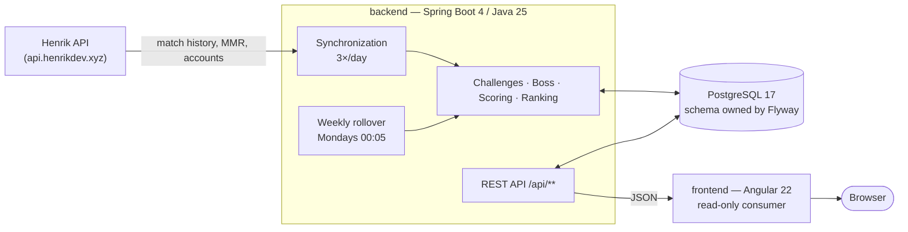

<div align="center">

# ValoQuests

**Seven friends. One Valorant week. One boss standing in the way.**

[](https://github.com/ThomasHtn/valorant-tracker/actions/workflows/backend-ci.yml)
[](https://github.com/ThomasHtn/valorant-tracker/actions/workflows/frontend-ci.yml)

</div>

---

# Part I — Discover ValoQuests

## What is ValoQuests?

ValoQuests turns a group of friends playing Valorant into a weekly co-op campaign.

You keep playing exactly like you always do. In the background, ValoQuests pulls everyone's match
history from Riot, and every game you finish is turned into damage against a boss the whole squad
shares. Five challenges are drawn every Monday. Clear them, show up regularly, play together, and
the boss goes down before Sunday night. Slack off, and it survives into the next week — angrier.

No app to launch while you play. No score to enter by hand. You play, the week keeps score.

## Why ValoQuests?

Ranked climbing is a solo story. A group of friends playing together has no scoreboard of its own —
just a Discord call, a few screenshots, and an argument about who actually carried.

ValoQuests gives that group a shared week:

- **Everything counts.** A ranked win hits hardest, but a casual Deathmatch at 1 a.m. still lands a
  punch. Nobody is benched for playing the "wrong" mode.
- **Playing together beats grinding alone.** Bonuses reward the days you showed up and the
  challenges several of you cleared, not raw hours.
- **The week always ends somewhere.** Monday morning, the boss is dead or it isn't, and somebody is
  wearing the crown.

It is built for one specific squad of seven and makes no attempt to be a public service. That is the
point: everything on screen is about *your* group.

## What can you do with it?

**Follow the week as it happens.** The overview puts the boss's health bar, the squad's progress and
the live ranking on one screen. It refreshes as matches get imported through the day.

**Chase five challenges, one per tier.** Every Monday a fresh pack is drawn from a catalogue of 62 —
one easy, one normal, one medium, one hard, one very hard. Categories are varied on purpose so a week
never turns into five variations of the same grind.

**Watch the campaign build up.** Bosses are drawn without repeating until the catalogue is exhausted,
and the fight gets harder every time you win, easier every time one survives. The campaign timeline
keeps every past week, its boss, its outcome and its ranking.

**Dig into any player.** Competitive rank, win rate, KDA, headshot percentage, and a full match
history you can filter by game mode and by season.

**Learn the rules in a minute.** A guided tour walks first-time visitors through the loop in five
steps, and the rules page holds the exact numbers — damage per mode, damage per difficulty, bonus
tables.

**Read it in your language.** The whole interface ships in English and French, switchable from the
sidebar.

### How a week actually plays out

| When | What happens |
| --- | --- |
| Monday 00:05 | The previous week is finalized and frozen. A new boss is drawn, a new pack of five challenges opens. |
| All week | Matches are imported three times a day. Every match and every cleared challenge drains the boss's HP. |
| Sunday 23:59 | The week closes. The boss is either down or it survived — which changes how hard the next one hits. |

Damage adds up per player into the weekly ranking, plus two bonuses that reward the shape of your
week rather than its volume: a **regularity bonus** for the number of distinct days you played, and a
**squad bonus** for every player who cleared the same challenge you did.

## See it in action

> **Heads-up:** no screenshots are committed yet. Capturing them means running a full Riot data
> import against a live API key, which has not been done for this repository. When they land, they
> belong in `docs/images/` and slot into the table below. Until then, here is what each screen is
> for.

| Screen | What you are looking at |
| --- | --- |
| **Landing** (`/`) | A full-bleed doorway with no navigation, shown once per visitor. A compass takes you in. |
| **Guided tour** (`/tour`) | Five steps — the idea, the boss, the challenges, the ranking, the squad — each illustrated with the *real* component you are about to meet, not a mockup. |
| **Overview** (`/overview`) | The week at a glance: boss encounter, squad progress, podium, countdown to Sunday. |
| **Challenges** (`/challenges`) | The five challenges of the week, per tier, with who has cleared what. |
| **Campaign** (`/campaign`) | The boss timeline, week by week, each entry opening onto that week's ranking. |
| **Leaderboard** (`/leaderboard`) | The live weekly ranking and the champion's crown. |
| **Players** (`/players`) and **profile** (`/players/:id`) | The roster with rank, win rate, KDA and match count; then one player's full history, filterable by mode and season. |
| **Rules** (`/rules`) | Every number that decides a week, in one page. |

## Ready to go deeper?

That is the product. Below is how it is built — a Spring Boot API that owns every calculation, an
Angular site that owns none of them, and two scheduled jobs that keep the week turning without anyone
touching a button.

---

# Part II — Under the hood

> This section is the system-wide map. Each application documents its own internals:
> **[backend/README.md](backend/README.md)** and **[frontend/README.md](frontend/README.md)**.

## System at a glance



Three properties define the system:

1. **The backend owns every number.** Damage, bonuses, boss HP, rankings and challenge progress are
   all computed and persisted server-side. The frontend renders what the API returns and computes
   nothing of its own.
2. **The week is derived, never accumulated.** No mutable counter is kept anywhere. Challenge
   progress, the weekly ranking and the boss's remaining HP can all be rebuilt from stored matches at
   any time — which is exactly what the backoffice's recalculation commands do.
3. **The Monday is the week's identity.** There is no `week` table. Every weekly row is keyed by the
   `LocalDate` of its Monday, resolved by a single `WeekCalendar` in one configured time zone, so
   nothing can disagree about where a week starts.

## Repository layout

```text
valo-quests
├── backend/     Java 25 · Spring Boot 4 · PostgreSQL · Flyway — the API and every calculation
├── frontend/    Angular 22 · TypeScript · Tailwind v4 — the read-only site
└── .github/     One CI workflow per application, each triggered only by its own path
```

The two applications are built, tested, linted and released independently. A change scoped to one
should never require touching the other.

## How data flows

### 1. Import — Riot to database

`StandardSynchronizationScheduler` fires three times a day and walks every active player.

For each player, `SeasonMatchHistoryWalker` pages backwards through Henrik's match history, newest
first, staying within the season of the newest match. A season is only marked complete once the walk
has *proved* it reached that season's oldest match; until then the next run re-walks it in full
rather than trusting a partial history. Per-season checkpoints are persisted so an interrupted import
resumes instead of restarting.

Critically, **the import runs outside any surrounding transaction** — each step commits on its own, so
a late failure cannot erase the checkpoints that say a season is still being caught up. A
`NonTransactionalGuard` enforces this at the entry point.

Every execution that actually imported something ends by recalculating challenge progress and the
ranking, which is what keeps the live view honest between two scheduled runs.

### 2. Scoring — matches to damage

Stored matches are turned into damage by a **versioned ruleset** (`scoring/ScoringRulesetV1`). Its
values are frozen by contract: an adjustment ships as `ScoringRulesetV2` registered alongside V1, and
each weekly boss encounter records the ruleset version it was resolved under, so a week already
finalized keeps recalculating identically forever.

| Damage source | Range |
| --- | --- |
| Match, by mode and outcome | 100 (Deathmatch loss) → 500 (Competitive win) |
| Cleared challenge, by tier | 1 500 (easy) → 9 000 (very hard) |
| Regularity bonus, by days played | 0 (1 day) → 3 000 (7 days) |
| Squad bonus, per player, by how many cleared the same challenge | 150 (2 players) → 1 100 (6+) |
| Boss base HP, by category | 80 000 (minor) · 95 000 (standard) · 115 000 (elite) |

Boss difficulty is self-correcting: a modifier starts at 100 %, gains 5 points when the squad wins,
loses 10 when the boss survives, and is clamped to 70–130 %. Effective HP is base HP times that
modifier, frozen at selection time.

### 3. Rollover — closing and opening a week

`WeeklyRolloverScheduler` runs every Monday at 00:05. `DefaultWeeklyRolloverService` refreshes the
closing week's progress, finalizes its challenges and score snapshots, closes its boss encounter, then
draws the new week's boss and challenge pack — **all in a single transaction**, so a failure opening
the new week also rolls back the closing of the old one.

### 4. Read — database to browser

The frontend is a plain HTTP consumer of `/api/**`. Public reads need no credential; every response
is JSON, paginated collections share one `PageResponse<T>` envelope, and failures share one
problem-details shape (`ApiErrorResponse`). The interactive contract is the backend's Swagger UI.

## Security model

There are no user accounts. Public data is public, and a single shared secret gates everything else.

- `GET /api/**` is open. So are `/actuator/health`, `/actuator/info` and the Swagger routes.
- `/api/admin/**` is gated by `AdminApiKeyFilter`, a custom filter that compares the `X-Admin-Key`
  header against `ADMIN_API_KEY` in constant time, before Spring Security's own chain.
- Repeated invalid keys from one address trigger an in-memory lockout (HTTP 429).
- Sessions are stateless, CSRF is disabled, and CORS is restricted to a single configured origin.
- Everything else is denied.

The frontend's `/admin` area mirrors this: it holds the key in `sessionStorage`, attaches it only to
`/api/admin` requests, and signs out the moment the backend answers 401 or 403. Its route guard is a
convenience, not a boundary — **the API is the boundary**.

## The backoffice

`/admin` is reachable by URL only; nothing in the site links to it. It exists so one operator can
curate this one group and repair the weekly loop by hand:

- **Operations** — trigger a full or per-player synchronization, force the current week's selection,
  rebuild challenge progress or the ranking, and inspect synchronization runs.
- **Players** — add, edit, activate, deactivate, archive or delete a roster entry. Archiving rather
  than deleting preserves the finalized weeks a player took part in.
- **Maintenance** — an irreversible wipe of every record derived from match history.
- **Design system** — the live catalogue of every design token and shared component.

## Running the whole stack locally

Two terminals. The backend must be up before the frontend shows anything real.

```bash
# terminal 1 — API + database
cd backend
cp .env.example .env          # fill in HENRIK_API_KEY and ADMIN_API_KEY at minimum
docker compose up -d          # PostgreSQL 17
./mvnw spring-boot:run        # http://localhost:8080
```

```bash
# terminal 2 — website
cd frontend
npm install
npm start                     # http://localhost:4200, proxies /api to :8080
```

Full setup, configuration reference and troubleshooting live in each application's README.

## Quality gates

Each application enforces its own gate in CI, triggered only by changes under its own path.

| | Command | What it enforces |
| --- | --- | --- |
| Backend | `./mvnw verify` | JUnit + Testcontainers suites, Checkstyle, SpotBugs, JaCoCo (≥ 90 % line, ≥ 70 % branch) |
| Frontend | `npm run format:check && npm run lint && npm test && npm run build` | Prettier, angular-eslint, Vitest, production build with size budgets |

## Where to go next

| You want to… | Read |
| --- | --- |
| Work on the site, its components, styling or state | [frontend/README.md](frontend/README.md) |
| Work on the API, the domain rules, persistence or scheduling | [backend/README.md](backend/README.md) |
| Explore the live API contract | Swagger UI at `http://localhost:8080/swagger-ui.html` |

## License

[MIT](LICENSE)
