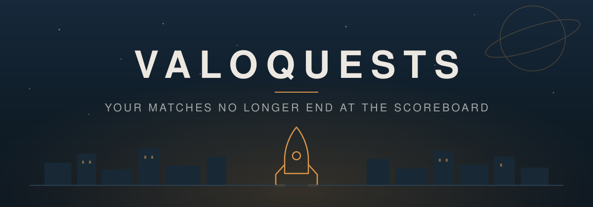
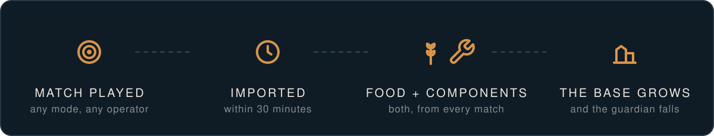
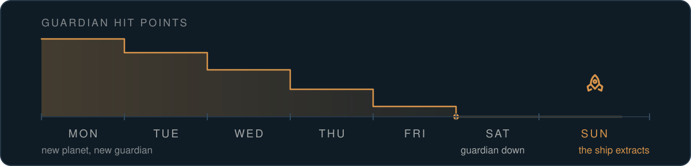

  

  <strong>Ten weeks. Ten planets. One base that only grows when you play.</strong>

<!-- Demo: drop the capture at docs/media/demo.gif, then uncomment the block below.

  

-->

---

## Every match already meant something to you. Now it means something to everyone.

Your squad plays what it always plays. ValoQuests reads every match minutes after the lobby closes and
turns it into a rescue campaign the whole roster shares. Nothing to declare. Nothing to screenshot.
Nothing to chase on a Sunday night.

  

---

##  Two resources. Both from every match.

Competitive mostly brings back **components**, the gear it takes to reach the wounded. Deathmatch
mostly brings back **food**, what feeds the base tonight and settles the rescued on Sunday.

These are real stocks. Nothing is wiped on Monday. What you do not spend, you keep for the week that
will need it.

| A match | Value |  Food |  Components |
|---|---|---|---|
| Competitive win | 500 | 150 | 350 |
| Competitive loss | 350 | 105 | 245 |
| Deathmatch win | 150 | 105 | 45 |
| Deathmatch loss | 100 | 70 | 30 |

---

##  Seven days. One guardian. One Sunday.

Monday, a new planet. A guardian holds the ground between the ship and the wounded left on it. Every
match, by every operator, takes hit points off it. Its bar falls while you play.

  

- **It can fall on Tuesday afternoon.** The week keeps paying until Sunday either way.
- **Challenges deal it no damage.** They bring wounded home whatever happens, spending nothing. A
  bonus, never a toll.
- **Push it to 93% and the base loses 0.2%.** Falling short is survivable. Doing nothing is not.

---

##  Every mode counts. Even the ten minute one.

| Mode |  Food |  Components |
|---|---|---|
| Competitive, Premier, Unrated | 30% | **70%** |
| Deathmatch, Team Deathmatch, Spike Rush, Skirmish | **70%** | 30% |

Ranked pays more per match. It also takes 35 minutes. Every value is tuned so that an hour of play is
worth about the same wherever you spend it, which means nobody in the squad is ever told what to queue.

---

##  Showing up beats grinding.

| Match of the day | 1 to 5 | 6 to 9 | 10 and beyond |
|---|---|---|---|
| Worth | 100% | 50% | 25% |

| Days in a row | 1 | 2 | 3 | 4 | 5 | 6+ |
|---|---|---|---|---|---|---|
| Bonus | 0% | +2% | +4% | +6% | +8% | **+10%** |

The sixth match of the night is worth half. The tenth, a quarter. And the streak bonus stops at 10% on
purpose: miss a day, and first place is still within reach.

---

##  Calibrated to your squad. Not to strangers.

Before week one, ValoQuests reads **nine months of history** for everyone on the roster and sizes the
entire campaign around it. Guardians, groups of wounded, challenge rewards, all of it, per active
player. Two operators or twenty, the campaign plays the same.

| Tier | Weekly reference per player | Roughly |
|---|---|---|
| Amateur | under 3,500 | 4 competitive and 3 quick matches a week |
| Normal | 3,500 to 9,000 | 7 competitive and 9 quick matches |
| Confirmed | 9,000 to 16,000 | 16 competitive and 25 quick matches |
| Elite | over 16,000 | 28 competitive and 35 quick matches |

A casual five stack and a full academy roster both end up defeating around **8 guardians out of 10**.
The tier is what lets their two campaigns be read side by side.

---

##  Four titles. Every week. Rarely the same player.

| Title | Goes to |
|---|---|
|  **Mechanic** | The most components over the week |
|  **Quartermaster** | The most food |
|  **Regular** | The longest streak of days played |
|  **Scout** | The most challenges validated |

The weekly leaderboard counts guardian damage and wounded brought home, and resets every Monday.
Nobody is ever out of the campaign because of one bad week.

---

## For the squad. And for the club.

|  Players |  Clubs and coaches |
|---|---|
| A goal that survives a losing streak | Who is actually playing, week by week |
| A leaderboard that starts over every Monday | One objective the whole roster shares for ten weeks |
| Titles, streaks, profiles, match by match detail | Dashboards a non player reads in thirty seconds |
| Solo queue still counts toward the team goal | A closed campaign, archived, its score frozen |

---

##  Inside

| Screen | What it shows |
|---|---|
| **Overview** | The base at night, the rocket under construction, this week's situation report |
| **Campaign** | The road of ten planets, each with its guardian, its group and its outcome |
| **Challenges** | One drawn every morning, five drawn every Monday, one per difficulty |
| **Leaderboard** | Guardian damage, wounded brought home, and the week's four titles |
| **Squad** | Profiles, streaks, agents, and every match in detail |
| **Rules** | The whole game explained in the app, plus a guided tour |

---

  Angular front end · Spring Boot API · matches imported from the HenrikDev API 
  <a href="backend/README.md">backend</a> · <a href="frontend/README.md">frontend</a> · <a href="docs/">specifications</a>

