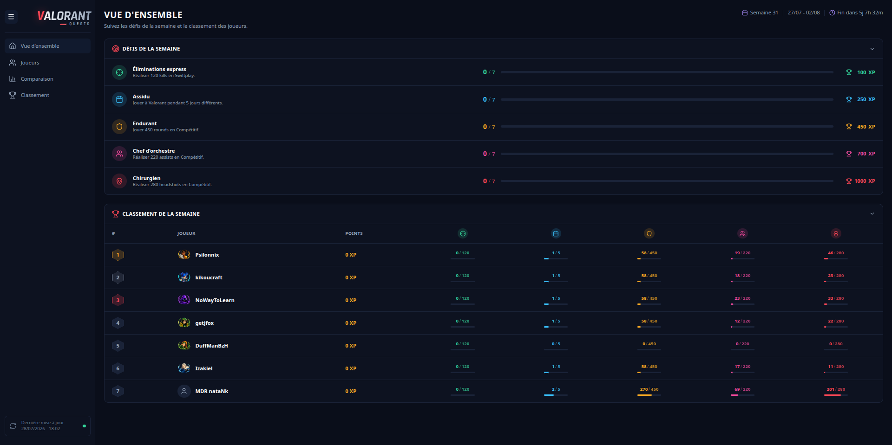
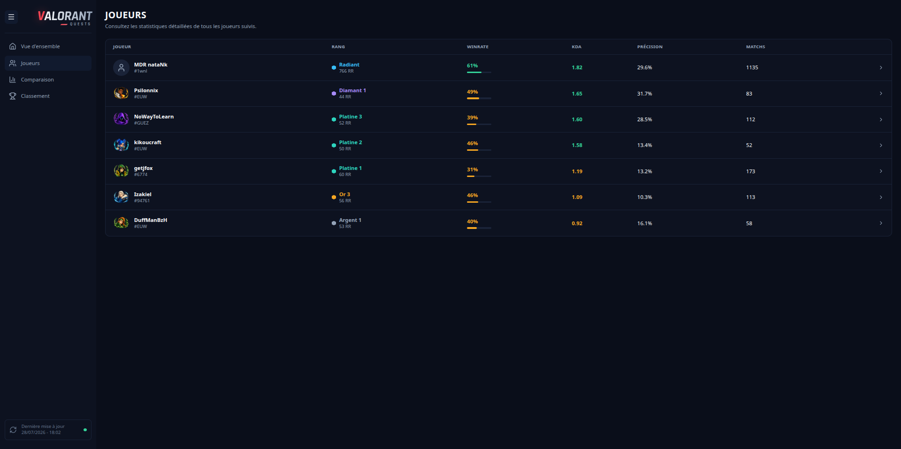

<div align="center">

# Valorant Tracker

**Turn match history into weekly rivalries.**

A full-stack portfolio project that imports Valorant match data, calculates player statistics, tracks weekly challenges
and builds a live ranking for a fixed group of players.

`Java 25` · `Spring Boot 4` · `Angular 22` · `PostgreSQL` · `Henrik API`

[](https://github.com/ThomasHtn/valorant-tracker/actions/workflows/backend-ci.yml)

</div>

---

## The idea

Valorant Tracker started from a simple question:

> Who actually had the best week?

The application follows a small group of players, imports their matches several times a day and turns raw game data into
player statistics, match history, weekly challenges and a ranking that evolves after every synchronization.

The project is also a practical playground for modern full-stack architecture, external API integration, scheduled
processing, data normalization and automated testing.

## What the application does

### Player tracking

Each tracked account has a detailed profile containing its current competitive rank, match history and aggregated
statistics such as KDA, win rate, headshot percentage, ACS and ADR.

### Weekly challenges

Every week, the application selects a balanced challenge set from a catalogue of 78 definitions.

Challenges cover volume, performance, streaks, ratios, game modes, distinct agents and grouped objectives. Progress is
recalculated from persisted matches, making results deterministic and reproducible.

### Live ranking

Completed challenges award points and feed a weekly ranking.

The backend stores current and previous positions, completed challenge counts and detailed per-player progress so the
frontend can show both the leaderboard and the story behind it.

### Automatic synchronization

Scheduled jobs retrieve account, rank and match-history data from the Henrik API.

Imports are incremental and idempotent:

- existing matches are not duplicated;
- player-match associations are protected by database constraints;
- one player failure does not block the others;
- retries and request spacing protect the integration from temporary failures and rate limits;
- standard and deep synchronization modes cover daily updates and historical imports.

## Main screens

The interface keeps the weekly competition readable at a glance while still allowing deeper analysis when needed.
Screenshots below are live captures of the running application (see [`frontend/docs/preview`](frontend/docs/preview)).

### Weekly overview

Active challenges, collective progress and the current leaderboard are gathered on the main page.



### Player list

Every tracked player is listed with rank, win rate, KDA and match count at a glance.



Player profile, player comparison and ranking history screens are designed (see [`frontend/docs/images`](frontend/docs/images))
and scheduled for upcoming iterations.

## Technology stack

### Backend

- Java 25
- Spring Boot 4.0.6
- Spring MVC and WebClient
- Spring Data JPA and Hibernate
- Spring Security
- Spring Boot Actuator
- Springdoc OpenAPI
- MapStruct and Lombok

### Data and tooling

- PostgreSQL 17
- Flyway
- Maven Wrapper
- Docker Compose

### Tests

- JUnit 5
- Mockito
- AssertJ
- H2 in PostgreSQL compatibility mode
- MockWebServer

## Repository structure

The project is organized as a monorepo:

```text
valorant-tracker
├── backend    Java 25 / Spring Boot API (Maven project) — see backend/README.md
├── frontend   Angular 22 application, including UI mockups — see frontend/README.md
└── scripts    Operational scripts
```

Each module owns its own environment configuration, Docker Compose file (backend) and detailed setup, build and test
instructions. Start with `backend/README.md` and `frontend/README.md`.

## Development conventions

- code, comments, Javadoc, logs and technical documentation are written in English;
- lines remain within 120 characters;
- feature boundaries are preserved;
- controllers delegate business decisions to services;
- external imports remain idempotent;
- logs include identifiers and counts, never secrets or complete payloads;
- bug fixes and business rules are covered by tests;
- applied Flyway migrations are immutable.

---

<div align="center">

Built as a portfolio project, tested as a real application.

</div>
