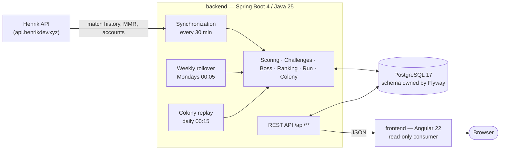

<div align="center">

# ValoQuests

**Seven friends. One Valorant run. A town that only grows if everybody shows up.**

[](https://github.com/ThomasHtn/valorant-tracker/actions/workflows/backend-ci.yml)
[](https://github.com/ThomasHtn/valorant-tracker/actions/workflows/frontend-ci.yml)

</div>

---

# Part I — Discover ValoQuests

## What is ValoQuests?

ValoQuests turns a group of friends playing Valorant into a shared campaign.

You keep playing exactly like you always do. In the background, ValoQuests pulls everyone's match
history from Riot, and every game you finish does two things at once: it damages the boss of the week
and it feeds a town the whole squad is building over ten weeks.

No app to launch while you play. No score to enter by hand. You play, the week keeps score.

## Why ValoQuests?

Ranked climbing is a solo story. A group of friends playing together has no scoreboard of its own —
just a Discord call, a few screenshots, and an argument about who actually carried.

ValoQuests gives that group two things at the same time:

- **A weekly duel.** Who is on top of the ladder this week, reset every Monday.
- **A ten-week common project.** A colony whose final population is the score of the whole run —
  something no one can carry alone, because it is fed by how many of you turned up, not by how long
  one of you sat there.

And it is deliberately generous about *how* you play:

- **Everything counts.** A ranked win hits hardest, but a Deathmatch at 1 a.m. still lands a punch.
  Nobody is benched for playing the "wrong" mode.
- **Showing up beats grinding.** Past your fifth game of the day a match is worth half, past the
  ninth a quarter — while playing on six different days is worth thousands of points on its own.
- **The week always ends somewhere.** Monday morning, the boss is dead or it isn't, somebody wears
  the crown, and the town is one step bigger or exactly where you left it.

## The two things you are playing for

### 1. The week — one boss, five challenges, one crown

Every Monday a new pack of five challenges opens, one per difficulty, drawn from a catalogue of 63.
A boss shows up in front of the squad. Everything you play until Sunday 23:59 drains its health bar,
and the same numbers, added up per player, build the weekly ranking.

| What you did | What it is worth |
| --- | --- |
| Competitive or Premier match | 350 loss · 425 draw · 500 win |
| Unrated | 280 · 340 · 400 |
| Spike Rush · Skirmish · Team Deathmatch · Deathmatch | 100 to 180 |
| Clearing a challenge | 800 (easy) → 4 500 (very hard) |
| Clearing it alongside the squad | +10 % per other player who cleared it, up to +50 % |
| Playing on several days | up to 6 000 for a full seven-day week |

The boss is not a fixed wall: its health is a share of what **your** squad has actually been
producing over the last four finalized weeks, per active player. It follows the group as it gets
better, busier or quieter, and a squad of two is asked exactly as much as a squad of seven. A player
left active but absent all week still carries their share of the health bar without dealing any
damage, which is what makes attendance a collective commitment.

### 2. The run — ten weeks and a town

A **run** is exactly ten weeks, plus a settlement day on the 71st. The population standing on that
last day is the run's score, and the whole run is comparable to every other one by construction.

The town lives on three resources:

| Resource | Where it comes from | What it does |
| --- | --- | --- |
| **Food** | Your daily match damage, multiplied by how many of you played that day | Says how many inhabitants the town can feed. Perishable: it is forgotten after seven days |
| **Materials** | Cleared challenges and defeated bosses | Permanently raise efficiency — how many inhabitants one point of food feeds — and step the town up a tier ladder |
| **Morale** | +3 / +5 / +7 for a defeated boss, −7 for one that survives | Sets how fast the population climbs towards what its food can feed |

Every night the town moves a share of the gap between where it is and what it can feed. Nothing is
ever wasted and there is no ceiling on materials: a challenge cleared on the last Monday is worth
exactly what one cleared on the first was.

The tier ladder is the visible reward — **Camp → Hamlet → Village → Borough → Town → City →
Residential quarter → Great city → Metropolis → Megalopolis → Capital → Citadel**, then numbered
citadels without a maximum. A regular run climbs about one tier a week.

### How a run is shaped

A run does not draw its difficulty at random — it schedules it, so you can see the peaks coming:

| Week | 1 | 2 | 3 | 4 | 5 | 6 | 7 | 8 | 9 | 10 |
| --- | --- | --- | --- | --- | --- | --- | --- | --- | --- | --- |
| Boss | minor | standard | standard | standard | **elite** | minor | standard | standard | standard | **elite** |

Winning all ten takes morale from the 50 a run opens on to exactly 100 — so the last fight of a
flawless run is still the one that tops the gauge out, and none of the ten is ever a dead fight.

## What can you do with it?

**Follow the week as it happens.** The overview puts the boss's health bar, the colony summary and
the live ranking on one screen. It refreshes as matches get imported, every half hour.

**Watch the town grow.** `/campaign` holds the run's map, the boss timeline, the food track with its
seven-day window, morale, turnout, the tier ladder and the population curve of the whole run.

**Chase five challenges, one per tier.** Categories are varied on purpose, so a week never turns into
five variations of the same grind. Some of them measure you against your *own* recent form rather
than against raw volume.

**Dig into any player.** Competitive rank, win rate, KDA, headshot percentage, a progression chart,
and a full match history filterable by game mode and by season.

**Learn the rules in a minute.** A guided tour walks first-time visitors through the loop, and the
rules page holds every exact number — damage per mode, damage per difficulty, boss ladder, colony
economy.

**Read it in your language.** The whole interface ships in English and French, switchable from the
sidebar.

### The weekly clock

| When | What happens |
| --- | --- |
| Every 30 minutes | Matches are imported from Riot, and the colony is replayed from its inputs |
| Monday 00:05 | The previous week is finalized and frozen. A new boss is drawn, a new pack of five challenges opens, and a run is opened if the last one just ended |
| Monday 00:15 | The colony replays the week that just closed — challenge and boss materials, morale, then the night |
| Sunday 23:59 | The week closes. The boss is either down or it isn't |

## Try it with your own squad

The roster is not hard-coded into the product — it is data. Clone the repository, run the stack (see
[Part II](#part-ii--running-it-yourself), it takes about ten minutes), open `/admin`, replace the
seeded players with your own Riot IDs, and trigger a first synchronization. Your first run opens on
the next Monday rollover, or immediately if you force the week's selection from the backoffice.

You need one free [HenrikDev API key](https://docs.henrikdev.xyz/), Docker, a JDK and Node. That is
the whole shopping list.

> **A note on scope, so nothing surprises you.** ValoQuests is a personal, portfolio-style project
> built for one fixed group of friends. There are no accounts, no sign-up, no multi-tenancy: one
> deployment tracks one squad, and a single shared admin key gates everything an operator can do.
> That is a deliberate design decision, not a missing feature.

## The screens

> **Heads-up:** no screenshots are committed yet. Capturing them means running a full Riot import
> against a live API key, which has not been done for this repository. When they land, they belong in
> `docs/images/` and slot into the table below.

| Screen | What you are looking at |
| --- | --- |
| **Landing** (`/`) | A full-bleed doorway with no navigation, shown once per visitor |
| **Guided tour** (`/tour`) | The idea, the boss, the challenges, the colony, the ranking — each illustrated with the *real* component you are about to meet, not a mockup |
| **Overview** (`/overview`) | The week at a glance: boss encounter, colony summary, podium, countdown to Sunday |
| **Challenges** (`/challenges`) | The five challenges of the week, per tier, with who has cleared what |
| **Campaign** (`/campaign`) | The run's map, the boss timeline, and every colony gauge |
| **Leaderboard** (`/leaderboard`) | The live weekly ranking and the champion's crown |
| **Players** (`/players`, `/players/:id`) | The roster, then one player's full history and progression |
| **Rules** (`/rules`) | Every number that decides a week and a run, in one page |
| **Backoffice** (`/admin`) | URL-only, key-gated: roster curation and manual repair of the weekly loop |

---

# Part II — Running it yourself

> This part assumes nothing. Follow it top to bottom and you will have the stack running.
> Each application also documents its own internals: **[backend/README.md](backend/README.md)** and
> **[frontend/README.md](frontend/README.md)**.

## 1. What you need first

| Tool | Version | Check it with | Notes |
| --- | --- | --- | --- |
| JDK | **25** | `java -version` | Nothing older compiles: the domain uses Java 25 language features |
| Docker + Compose | any recent | `docker compose version` | Runs PostgreSQL, and the backend's integration tests |
| Node.js | **22 LTS or newer** | `node -v` | Angular 22 refuses older runtimes |
| Git | any | `git --version` | |
| HenrikDev API key | free | — | Request one at [docs.henrikdev.xyz](https://docs.henrikdev.xyz/). Without it the app starts but every import fails |

Maven is **not** in that list — the repository ships the Maven Wrapper (`./mvnw`), which downloads
the right Maven for you on first run.

```bash
git clone https://github.com/ThomasHtn/valorant-tracker.git valoquests
cd valoquests
```

## 2. Start the backend (terminal 1)

```bash
cd backend

cp .env.example .env
```

Now open `.env` and set two values that have no usable default:

```dotenv
HENRIK_API_KEY=your-henrik-key
ADMIN_API_KEY=a-long-random-secret-you-invent   # 32+ characters, this is your only credential
```

Everything else in `.env.example` already matches `docker-compose.yml` and works as-is. Then:

```bash
docker compose up -d     # PostgreSQL 17, on localhost:5432
docker compose ps        # wait until the postgres service reports "healthy"

./mvnw spring-boot:run   # first run downloads Maven and the dependencies — a few minutes
```

The API is up when the log ends on `Started ValoQuestsApplication`. Verify it:

```bash
curl http://localhost:8080/actuator/health
# {"status":"UP"}
```

| What | URL |
| --- | --- |
| API | `http://localhost:8080/api/...` |
| Swagger UI | `http://localhost:8080/swagger-ui.html` |
| OpenAPI document | `http://localhost:8080/api-docs` |
| Health | `http://localhost:8080/actuator/health` |

Swagger is served only when `API_DOCS_ENABLED=true` — `.env.example` turns it on because that is what
local development wants. Its **Authorize** button takes your `ADMIN_API_KEY` and unlocks the
administrative routes.

**Leave this terminal running.** Flyway created the schema on startup and seeded the challenge
catalogue, the boss catalogue and a roster; there is no match data yet.

## 3. Start the frontend (terminal 2)

```bash
cd frontend

npm ci        # or `npm install` if you plan to change dependencies
npm start     # http://localhost:4200
```

`npm start` proxies every `/api/...` call to `http://localhost:8080` (`proxy.conf.json`), so the dev
server and the API stay same-origin and there is no CORS setup to do locally.

Open `http://localhost:4200`. You will get the landing page, then a site full of empty states — which
is correct, because nothing has been imported yet.

## 4. Load real data

Everything below can also be clicked through in the backoffice at
`http://localhost:4200/admin` (it asks for your `ADMIN_API_KEY`), which is the friendlier path. The
`curl` equivalents are here so you can see exactly what the UI does.

```bash
KEY=your-admin-api-key    # the ADMIN_API_KEY you put in backend/.env
```

**a. Put your own squad on the roster.** The seeded players are the author's friends; replace them
from `/admin` → *Players*, or over the API:

```bash
curl -X POST http://localhost:8080/api/admin/players \
  -H "X-Admin-Key: $KEY" -H 'Content-Type: application/json' \
  -d '{"gameName":"YourName","tagLine":"EUW","displayName":"You","status":"ACTIVE"}'
```

The Riot PUUID is left blank on purpose — it is resolved from the game name and tag line during the
player's first synchronization.

**b. Import their match history.** This is the long one: it walks each player's history season by
season, respecting Riot's rate limits.

```bash
curl -X POST http://localhost:8080/api/admin/synchronizations -H "X-Admin-Key: $KEY"

# it runs in the background — watch it:
curl http://localhost:8080/api/admin/synchronizations/latest -H "X-Admin-Key: $KEY"
```

**c. Open the current week** without waiting for Monday's rollover:

```bash
curl -X POST http://localhost:8080/api/admin/weeks/current/selection -H "X-Admin-Key: $KEY"
```

**d. Rebuild what is derived**, if a screen looks stale:

```bash
curl -X POST http://localhost:8080/api/admin/challenges/progress/recalculation -H "X-Admin-Key: $KEY"
curl -X POST http://localhost:8080/api/admin/rankings/recalculation -H "X-Admin-Key: $KEY"
curl -X POST http://localhost:8080/api/admin/colony/recompute -H "X-Admin-Key: $KEY"
```

None of these three is destructive: challenge progress, the ranking and the colony are *derived* from
stored matches, so recalculating only ever reproduces them.

Reload `http://localhost:4200/overview` — it should now show a boss, a ranking and a colony.

## 5. Every command you will actually use

### Backend — run from `backend/`

```bash
./mvnw spring-boot:run                                # start the API
./mvnw test                                           # fast tests only, no Docker needed
./mvnw verify                                         # full gate: tests + checkstyle + spotbugs + jacoco
./mvnw -Dtest=PlayerSynchronizationServiceTest test    # one test class
./mvnw clean                                          # wipe target/

docker compose up -d                                  # PostgreSQL
docker compose ps                                     # health
docker compose logs -f postgres                       # database logs
docker compose down                                   # stop it (keeps the data volume)
docker compose down -v                                # stop it and delete the data
```

### Frontend — run from `frontend/`

```bash
npm start              # dev server with proxy and live reload, :4200
npm run build          # production build → dist/frontend/browser/
npm run watch          # development build, rebuilt on change
npm test               # Vitest
npm run lint           # angular-eslint
npm run format         # prettier --write
npm run format:check   # prettier --check, what CI runs
```

### Before you push

```bash
cd backend  && ./mvnw verify
cd frontend && npm run format && npm run lint && npm test -- --watch=false && npm run build
```

CI runs exactly these, each triggered only by changes under its own path.

## 6. How it fits together



```text
valoquests
├── backend/     Java 25 · Spring Boot 4 · PostgreSQL 17 · Flyway — the API and every calculation
├── frontend/    Angular 22 · TypeScript · Tailwind v4 — the read-only site
└── .github/     One CI workflow per application, each triggered only by its own path
```

The two applications are built, tested, linted and released independently. A change scoped to one
should never require touching the other.

### Four properties that explain most of the code

1. **The backend owns every number.** Damage, bonuses, boss hit points, rankings, food, materials,
   morale and population are computed and persisted server-side. The frontend renders what the API
   returns and computes nothing of its own.
2. **Nothing is accumulated, everything is derived.** No mutable counter is kept anywhere. Challenge
   progress, the ranking, the boss's remaining health and the colony's whole history can be rebuilt
   from stored matches at any time — which is exactly what the backoffice's recalculation commands
   do, and why they are safe to run in any order.
3. **The Monday is the week's identity.** There is no `week` table. Every weekly row is keyed by the
   `LocalDate` of its Monday, resolved by a single `WeekCalendar` in one configured time zone, so
   nothing can disagree about where a week starts.
4. **One barème, read twice.** `scoring/ScoringRuleset` prices a match and a challenge once; the
   ranking and the colony both read that same object. The colony cannot drift from the ladder,
   because it is not allowed a second opinion on what a game is worth.

### The four flows

**Import.** `StandardSynchronizationScheduler` fires every 30 minutes and walks every active player.
`SeasonMatchHistoryWalker` pages backwards through Henrik's history, newest first, and only marks a
season complete once it has *proved* it reached that season's oldest match. Checkpoints are
persisted, so an interrupted import resumes instead of restarting — and the pipeline deliberately
runs **outside any surrounding transaction**, so a late failure cannot erase them.

**Scoring.** Stored matches become damage through `DefaultScoringRuleset`: per-mode value, daily
diminishing returns, challenge damage, team bonus, regularity bonus. `BossCalibrationService` sizes
the fight from the **median** per-player output of recent finalized weeks — a mean would let one
marathon week raise the bar for everyone.

**Rollover.** `WeeklyRolloverScheduler` runs Mondays at 00:05 and does the whole turn **in one
transaction**: refresh the closing week, finalize its challenges and scores, settle its boss, ensure
the run, then draw the next boss and challenge pack. A failure opening the new week also rolls back
the closing of the old one — a half-turned week has no sane repair path.

**Colony replay.** `ColonyReplayService` never mutates anything incrementally. It replays the run
from day one out of its persisted inputs and rewrites the daily snapshots, which is what makes the
daily tick, the post-sync hook and `POST /api/admin/colony/recompute` interchangeable and safe to
fire twice.

## 7. Security model

There are no user accounts. Public data is public, and a single shared secret gates everything else.

- `GET /api/**` is open, as are `/actuator/health`, `/actuator/info` and — when enabled — the Swagger
  routes.
- `/api/admin/**` is gated by `AdminApiKeyFilter`, which compares the `X-Admin-Key` header against
  `ADMIN_API_KEY` in constant time, before Spring Security's own chain.
- Repeated invalid keys from one address trigger an in-memory lockout (HTTP 429).
- Sessions are stateless, CSRF is disabled, CORS is restricted to a single configured origin.
- Everything else is denied.

The frontend's `/admin` area holds the key in `sessionStorage`, attaches it only to `/api/admin`
requests, and signs out the moment the backend answers 401 or 403. Its route guard is a convenience,
not a boundary — **the API is the boundary**.

## 8. The backoffice

`/admin` is reachable by URL only; nothing in the site links to it.

- **Operations** — trigger a full or per-player synchronization, force the current week's selection,
  rebuild challenge progress, the ranking or the colony, and inspect synchronization runs.
- **Players** — add, edit, activate, deactivate, archive or delete a roster entry. Archiving rather
  than deleting preserves the finalized weeks a player took part in.
- **Maintenance** — an irreversible wipe of every record derived from match history.

## 9. Quality gates

| | Command | What it enforces |
| --- | --- | --- |
| Backend | `./mvnw verify` | JUnit + Testcontainers suites, Checkstyle, SpotBugs, JaCoCo (≥ 90 % line, ≥ 70 % branch) |
| Frontend | `npm run format:check && npm run lint && npm test && npm run build` | Prettier, angular-eslint, Vitest, production build with size budgets |

Without Docker the backend's integration tests are **skipped, not failed** — a green local `verify`
on such a machine proves less than a green CI run.

## 10. When something goes wrong

| Symptom | Cause / fix |
| --- | --- |
| `./mvnw` fails on an unsupported class file version | You are not on JDK 25. `java -version` |
| Backend fails to start on a database connection | Postgres is down or `.env` disagrees with it. `docker compose ps` |
| Backend fails on schema validation | A migration is missing. Check Flyway's log; never edit an applied migration, append a new one |
| Every frontend screen shows its error state | The backend is not running on `localhost:8080` |
| `npm start` fails immediately | Run `npm ci` first |
| Site works but every player is empty | Nothing imported yet. `POST /api/admin/synchronizations` |
| No boss, no challenges | The week has never been opened. `POST /api/admin/weeks/current/selection` |
| Ranking or colony looks stale | Recalculate — they are derived, not accumulated |
| `/api/admin/**` returns 401 or 403 | `X-Admin-Key` missing or wrong |
| `/api/admin/**` returns 429 | Lockout after repeated invalid keys. Wait out `ADMIN_RATE_LIMIT_LOCKOUT_DURATION` |
| A synchronization ends `PARTIAL` | Per-player failures are recorded, not fatal. Inspect `GET /api/admin/synchronizations/{id}` |
| Redirected to `/overview` when opening `/` or `/tour` | The one-time-entry guards. Append `?replay` |
| CORS error in the browser console | `FRONTEND_ORIGIN` does not match where the frontend actually runs |

## Where to go next

| You want to… | Read |
| --- | --- |
| Work on the API, the domain rules, persistence or scheduling | [backend/README.md](backend/README.md) |
| Work on the site, its components, styling or state | [frontend/README.md](frontend/README.md) |
| Explore the live API contract | Swagger UI at `http://localhost:8080/swagger-ui.html` |

## License

[MIT](LICENSE)
