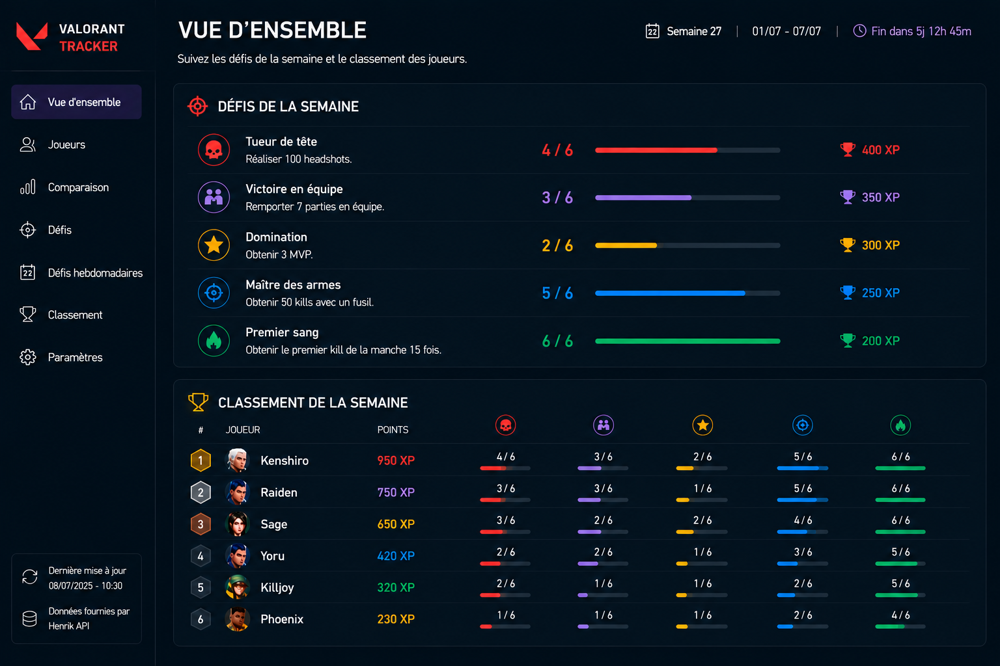
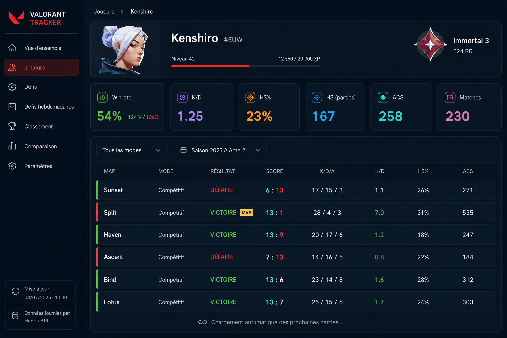
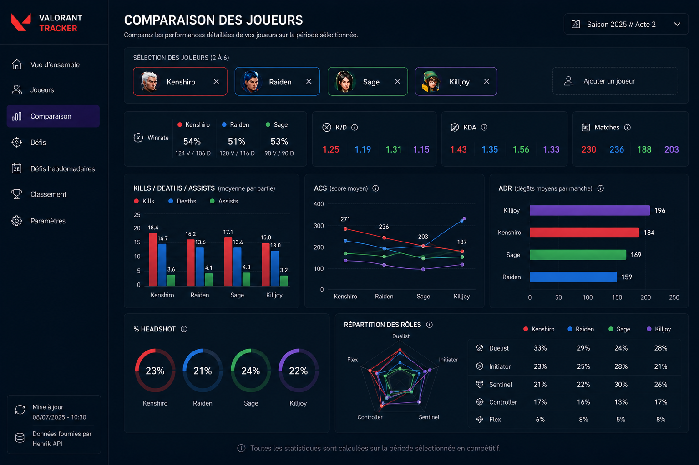
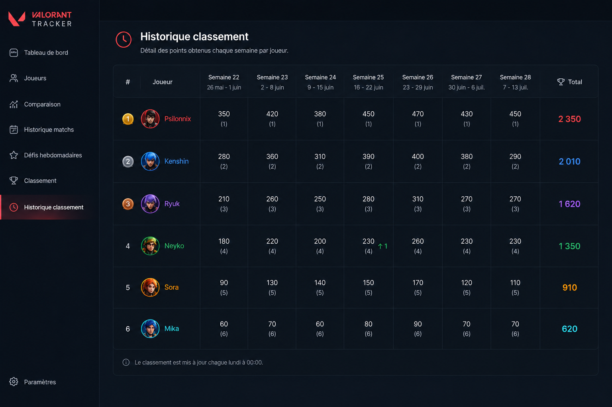

<div align="center">

# Valorant Tracker

**Turn match history into weekly rivalries.**

A full-stack portfolio project that imports Valorant match data, calculates player statistics,
tracks weekly challenges and builds a live ranking for a fixed group of players.

`Java 25` · `Spring Boot 4` · `Angular 22` · `PostgreSQL` · `Henrik API`

</div>

---

## The idea

Valorant Tracker started from a simple question:

> Who actually had the best week?

The application follows a small group of players, imports their matches several times a day and
turns raw game data into player statistics, match history, weekly challenges and a ranking that
evolves after every synchronization.

The project is also a practical playground for modern full-stack architecture, external API
integration, scheduled processing, data normalization and automated testing.

## What the application does

### Player tracking

Each tracked account has a detailed profile containing its current competitive rank, match
history and aggregated statistics such as KDA, win rate, headshot percentage, ACS and ADR.

### Weekly challenges

Every week, the application selects a balanced challenge set from a catalogue of 78 definitions.

Challenges cover volume, performance, streaks, ratios, game modes, distinct agents and grouped
objectives. Progress is recalculated from persisted matches, making results deterministic and
reproducible.

### Live ranking

Completed challenges award points and feed a weekly ranking.

The backend stores current and previous positions, completed challenge counts and detailed
per-player progress so the frontend can show both the leaderboard and the story behind it.

### Automatic synchronization

Scheduled jobs retrieve account, rank and match-history data from the Henrik API.

Imports are incremental and idempotent:

- existing matches are not duplicated;
- player-match associations are protected by database constraints;
- one player failure does not block the others;
- retries and request spacing protect the integration from temporary failures and rate limits;
- standard and deep synchronization modes cover daily updates and historical imports.

## Main screens

The interface keeps the weekly competition readable at a glance while still allowing deeper
analysis when needed.

### Weekly overview

Active challenges, collective progress and the current leaderboard are gathered on the main page.



### Player profile

Each player page combines key statistics with a paginated and filterable match history.



### Player comparison

Several tracked players can be compared through complementary performance indicators.



### Ranking history

Closed weeks remain available so previous results and winners can be reviewed later.



## Technology stack

### Backend

- Java 25
- Spring Boot 4.0.6
- Spring MVC and WebClient
- Spring Data JPA and Hibernate
- Spring Security
- Spring Boot Actuator
- Springdoc OpenAPI
- MapStruct and Lombok

### Data and tooling

- PostgreSQL 17
- Flyway
- Maven Wrapper
- Docker Compose

### Tests

- JUnit 5
- Mockito
- AssertJ
- H2 in PostgreSQL compatibility mode
- MockWebServer

## Architecture

The backend follows a feature-oriented architecture. Each domain owns its controllers, services,
repositories, entities, DTOs and business models.

```text
io.github.thomashtn.valorant.tracker
├── challenge        Weekly selection and progress calculation
├── henrik           External API clients, mapping, retry and rate limiting
├── match            Seasons, matches, statistics and idempotent imports
├── player           Tracked accounts, profiles and Riot account resolution
├── ranking          Weekly scores, positions and ranking history
├── synchronization  Standard and deep synchronization orchestration
└── shared           Security, errors, auditing and common web components
```

The project favors thin controllers, explicit transactions, constructor injection, immutable API
DTOs and database constraints for critical invariants.

## Synchronization flow

### Standard synchronization

1. Load an active tracked player.
2. Resolve the Riot PUUID when necessary.
3. Update the current competitive rank.
4. Retrieve recent match-history pages.
5. Import completed and previously unknown matches.
6. Recalculate weekly challenge progress.
7. Recalculate the ranking.
8. Store the successful synchronization timestamp.

### Deep synchronization

Deep synchronization explores older pages for initial imports or data recovery.

Its range is controlled by `DEEP_SYNC_SCOPE`:

- `CURRENT_SEASON` imports the current competitive season;
- `ALL_HISTORY` explores every available page.

A page limit and request delay prevent runaway processing and reduce pressure on the Henrik API.

## Challenge engine

Challenge definitions are stored as versioned JSON rules in PostgreSQL.

The engine supports sums, occurrence counts, distinct values, grouped maximums, composite
objectives, ratios and consecutive streaks.

A compatibility test parses every production challenge and verifies that its rule can be executed
by the calculator registry. This prevents unsupported catalogue changes from reaching production.

## Getting started

### Requirements

- JDK 25
- Docker and Docker Compose, or PostgreSQL 17
- a Henrik API key

The Maven Wrapper downloads Maven on its first execution, so an internet connection is required
the first time it runs.

### Configure the environment

```bash
cp .env.example .env
```

Set at least:

```dotenv
DB_URL=jdbc:postgresql://localhost:5432/valorant_tracker
DB_USERNAME=valorant
DB_PASSWORD=change-me
ADMIN_API_KEY=replace-with-a-long-random-secret
HENRIK_API_KEY=your-henrik-api-key
```

### Start PostgreSQL

```bash
docker compose up -d
docker compose ps
```

### Run the backend

```bash
./mvnw spring-boot:run
```

Useful URLs:

- Swagger UI: `http://localhost:8080/swagger-ui.html`
- OpenAPI document: `http://localhost:8080/api-docs`
- Health check: `http://localhost:8080/actuator/health`

Use Swagger's **Authorize** action to provide `X-Admin-Key` for administrative routes.

## Build and tests

```bash
./mvnw clean verify
```

```bash
./mvnw test
```

```bash
./mvnw -Dtest=PlayerSynchronizationServiceTest test
```

## Database migrations

Flyway is the only schema-management mechanism. Hibernate uses `ddl-auto=validate`.

```text
V1  Initial schema
V2  Initial player placeholder
V3  Challenge catalogue
V4  Henrik synchronization preparation
V5  Tracked players
V6  Optional season dates
V7  Extended team identifier
V8  Removal of the obsolete deep-sync task
V9  Query-supporting indexes
```

Never edit an applied migration. Add a new migration for every schema or reference-data change.

To reset the local database:

```sql
DROP SCHEMA public CASCADE;
CREATE SCHEMA public;
GRANT ALL ON SCHEMA public TO valorant;
GRANT ALL ON SCHEMA public TO public;
```

## Main API routes

### Public routes

```http
GET /api/challenges/current
GET /api/rankings/current
GET /api/rankings/history
GET /api/players
GET /api/players/{playerId}
GET /api/players/{playerId}/matches
```

### Administrative routes

All administrative routes require `X-Admin-Key`.

```http
POST /api/admin/synchronizations
POST /api/admin/players/{playerId}/synchronizations
POST /api/admin/synchronizations/deep
POST /api/admin/players/{playerId}/synchronizations/deep
POST /api/admin/challenges/progress/recalculation
POST /api/admin/rankings/recalculation
GET  /api/admin/synchronizations/latest
GET  /api/admin/synchronizations
GET  /api/admin/synchronizations/{synchronizationId}
```

## Configuration reference

| Variable | Default | Purpose |
|---|---|---|
| `DB_URL` | `jdbc:postgresql://localhost:5432/valorant_tracker` | PostgreSQL JDBC URL |
| `DB_USERNAME` | `valorant` | Database user |
| `DB_PASSWORD` | `valorant` | Database password |
| `ADMIN_API_KEY` | local development value | Protects `/api/admin/**` |
| `FRONTEND_ORIGIN` | `http://localhost:4200` | Allowed Angular origin |
| `HENRIK_API_BASE_URL` | `https://api.henrikdev.xyz` | Henrik API base URL |
| `HENRIK_API_KEY` | empty | Henrik API key |
| `HENRIK_API_REGION` | `eu` | Valorant region |
| `HENRIK_API_PLATFORM` | `pc` | Valorant platform |
| `HENRIK_API_MAX_ATTEMPTS` | `2` | Total request attempts |
| `HENRIK_API_RETRY_DELAY` | `PT60S` | Minimum retry delay |
| `HENRIK_API_REQUESTS_PER_MINUTE` | `28` | Shared request limit |
| `DEEP_SYNC_SCOPE` | `CURRENT_SEASON` | Historical import range |

## Development conventions

- code, comments, Javadoc, logs and technical documentation are written in English;
- lines remain within 120 characters;
- feature boundaries are preserved;
- controllers delegate business decisions to services;
- external imports remain idempotent;
- logs include identifiers and counts, never secrets or complete payloads;
- bug fixes and business rules are covered by tests;
- applied Flyway migrations are immutable.

---

<div align="center">

Built as a portfolio project, tested as a real application.

</div>
