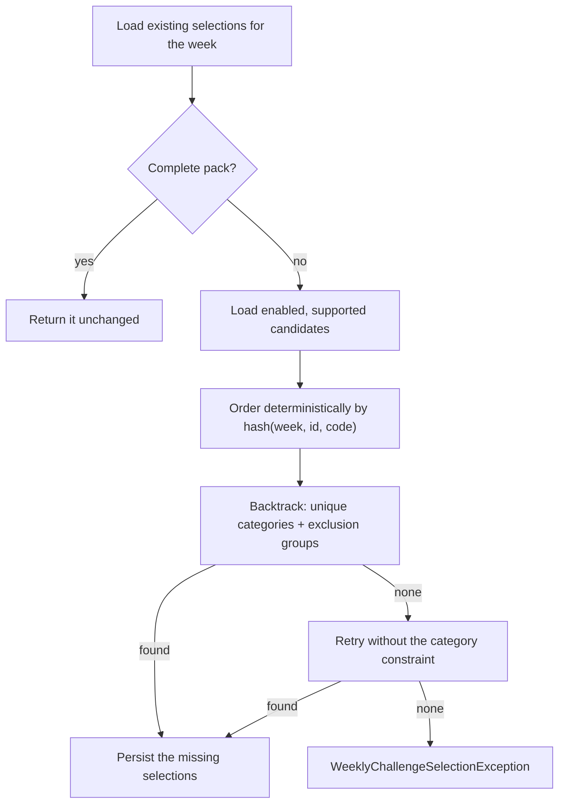

# Challenge engine

How a row in the `challenge` table becomes a number on a player's progress bar. The decision to express rules as data
rather than as code is recorded in [ADR 0004](../../docs/adr/0004-challenge-rules-as-json.md); the decision to recompute
rather than accumulate is [ADR 0009](../../docs/adr/0009-recompute-instead-of-accumulate.md).

## Rule format

A challenge's rule is a JSON array of conditions stored in `challenge.conditions_json`:

```json
[{ "metric": "KILLS", "operator": "GTE", "target": 180, "gameMode": "COMPETITIVE" }]
```

`JacksonChallengeDefinitionParser` deserializes it into `ChallengeCondition` records whose components are **enums, not
strings**, so an unknown metric or game mode fails at parse time rather than producing silently wrong progress. The
parser also rejects any challenge whose `schema_version` is not the supported one (currently `3`).

| Field           | Type                | Meaning                                                              |
| --------------- | ------------------- | -------------------------------------------------------------------- |
| `metric`        | `ChallengeMetric`   | What is measured                                                      |
| `operator`      | `ChallengeOperator` | Comparison. Only `GTE` exists: every challenge is "reach at least N"  |
| `target`        | `BigDecimal`        | Value required. Must be greater than zero                             |
| `gameMode`      | `ChallengeGameMode` | Optional filter. Absent means `ANY`                                   |
| `groupBy`       | `ChallengeGroupBy`  | Grouping dimension, required by `DISTINCT_COUNT` and `MAX_GROUP`      |
| `scope`         | `ChallengeScope`    | `WEEKLY` (default) or `PER_MATCH`                                     |
| `occurrences`   | `Integer`           | Number of matching matches required, used by `COUNT_MATCHES`          |
| `streak`        | `Integer`           | Consecutive-match target, required by `MAX_STREAK`                    |
| `minimumMatches`| `Integer`           | Sample-size floor, required by `RATIO`                                |

### Vocabulary

| Enum                | Values                                                                                   |
| ------------------- | ---------------------------------------------------------------------------------------- |
| `ChallengeMetric`   | `MATCHES_PLAYED`, `MATCHES_WON`, `KILLS`, `ASSISTS`, `HEADSHOTS`, `DAMAGE_DEALT`, `SCORE`, `ROUNDS_PLAYED`, `KD`, `PLAY_DAY` |
| `ChallengeGameMode` | `ANY`, `COMPETITIVE`, `DEATHMATCH`, `TEAM_DEATHMATCH`                                     |
| `ChallengeGroupBy`  | `AGENT`, `GAME_MODE`, `PLAY_DAY`                                                          |
| `ChallengeScope`    | `WEEKLY`, `PER_MATCH`                                                                     |
| `ChallengeRuleType` | `SINGLE`, `DISTINCT`, `GROUPED`, `COMPOSITE`, `OCCURRENCE`, `RATIO`, `STREAK`             |
| `ProgressMode`      | `SUM`, `DISTINCT_COUNT`, `MAX_GROUP`, `ALL`, `COUNT_MATCHES`, `RATIO`, `MAX_STREAK`       |
| `ChallengeDifficulty` | `EASY`, `NORMAL`, `MEDIUM`, `HARD`, `VERY_HARD`                                         |

`ChallengeGameMode` is intentionally narrower than the `GameMode` enum used for imports: it lists only the modes
challenges are actually written against.

`PLAY_DAY` is a metric with no per-match value - it is a grouping key, and `ChallengeMetricEvaluator` throws if asked to
evaluate it directly. Only `DISTINCT_COUNT` and `MAX_GROUP` accept it.

## Calculators

`progress_mode` selects the calculator; `ChallengeProgressCalculatorRegistry` maps one to the other. Every calculator
receives a `PlayerChallengeContext` holding the player, the week, its UTC boundaries and the player's eligible matches
in chronological order.

| Mode             | Progress is…                                                                 | Example                                              |
| ---------------- | ----------------------------------------------------------------------------- | ---------------------------------------------------- |
| `SUM`            | The metric summed across all eligible matches                                  | 180 kills in competitive                             |
| `COUNT_MATCHES`  | The number of matches that **independently** satisfy the condition             | 5 matches with at least 20 kills                     |
| `DISTINCT_COUNT` | The number of distinct values of the grouping dimension                        | 5 different agents; 4 different days played          |
| `MAX_GROUP`      | The largest accumulated value within a single group                            | Most matches played with one agent                   |
| `MAX_STREAK`     | The longest run of **consecutive** eligible matches satisfying a per-match condition | 3 wins in a row                              |
| `RATIO`          | A ratio computed from totals, guarded by a minimum sample size                 | K/D of 1.2 over at least 15 matches                  |
| `ALL`            | Every condition, each capped at its own target, then summed                    | 100 kills **and** 50 assists                         |

Three behaviors are worth stating explicitly because they are easy to get wrong and are deliberate here:

- **`MAX_STREAK` ignores rather than breaks.** Matches outside the configured game mode do not interrupt the sequence;
  a deathmatch played between two competitive wins does not reset a competitive win streak.
- **`RATIO` is computed from totals, not from an average of per-match ratios.** A K/D challenge divides total kills by
  total deaths across eligible matches. Averaging per-match ratios would let one 5-0 match outweigh ten mediocre ones.
  Completion additionally requires `minimumMatches` eligible matches, so a lucky single game cannot complete it.
- **`ALL` caps each condition before summing.** Overshooting one condition cannot compensate for an incomplete one, so
  the combined target is reachable only when every condition is genuinely met.

## Normalization

Every calculator returns a `ChallengeProgressResult` built through one factory, so all modes normalize identically:

- the current value is floored at zero;
- `completed` is `currentValue >= targetValue`;
- `progressPercentage` is `currentValue × 100 / targetValue`, two decimals, `HALF_UP`, capped at 100;
- a target of zero or less is rejected - it would make completion meaningless and the percentage undefined.

All arithmetic uses `BigDecimal`. Progress decides points, and a ratio compared in binary floating point would produce
results that differ between runs.

## Weekly selection

`DefaultWeeklyChallengeSelectionService` builds a pack of exactly one challenge per difficulty tier - five challenges.



**Determinism.** Candidates are ordered by `Objects.hash(weekStart, challenge.id, challenge.code)`, so the same week
produces the same pack across application restarts. The pack looks varied from week to week without being random.

**Eligibility.** A candidate must be `enabled` and its progress mode must be supported by the registry. An unsupported
challenge is skipped rather than drawn into a pack where it would sit permanently at zero.

**Constraints.** Selection uses bounded backtracking - the recursion depth is the number of difficulty tiers, and each
branch works on immutable state so a failed attempt cannot leak into a later one.

- *Exclusion groups are always enforced.* Two challenges sharing an `exclusion_group` never appear in the same week.
- *Category diversity is preferred, not required.* The service first tries to build a pack whose categories are all
  distinct; if none exists, it retries without that constraint rather than failing.

**Idempotency.** An existing pack is returned unchanged - challenges are never replaced during their week. Only missing
difficulty tiers are filled, which is what lets selection be re-run safely. A pack holding two challenges of the same
difficulty, or more entries than there are tiers, is rejected as an inconsistent state rather than silently repaired.

## Progress calculation

`DefaultChallengeRecalculationService` rebuilds the current week's progress:

1. resolve the week's boundaries through `WeekCalendar`;
2. load the week's challenge pack;
3. for each active player, build a `PlayerChallengeContext` from the matches played within those boundaries;
4. for each weekly challenge, parse its rule and run the matching calculator;
5. persist the results in batch through `PlayerChallengeProgressPersistenceService`.

Progress is **recomputed**, never incremented. `completed_at` is stamped on the transition to completed, and
`calculated_at` records the run.

This runs after any synchronization that imported something, at the weekly rollover before a week is frozen, and on
demand through `POST /api/admin/challenges/progress/recalculation`.

A finalized week is never recalculated.

## Catalogue safety

`ChallengeCatalogueCompatibilityTest` parses **every** production challenge definition and asserts that the calculator
registry supports its progress mode. A catalogue change that the engine cannot execute fails the build rather than
surfacing as a selection failure in production.

The catalogue currently holds 62 enabled definitions: `V3` seeded 78, and `V14` deleted the 16 filtered on a game mode
synchronization no longer imports. Deleting rather than disabling was deliberate - a disabled row would keep
referencing a `ChallengeGameMode` constant that no longer exists, breaking catalogue deserialization.
