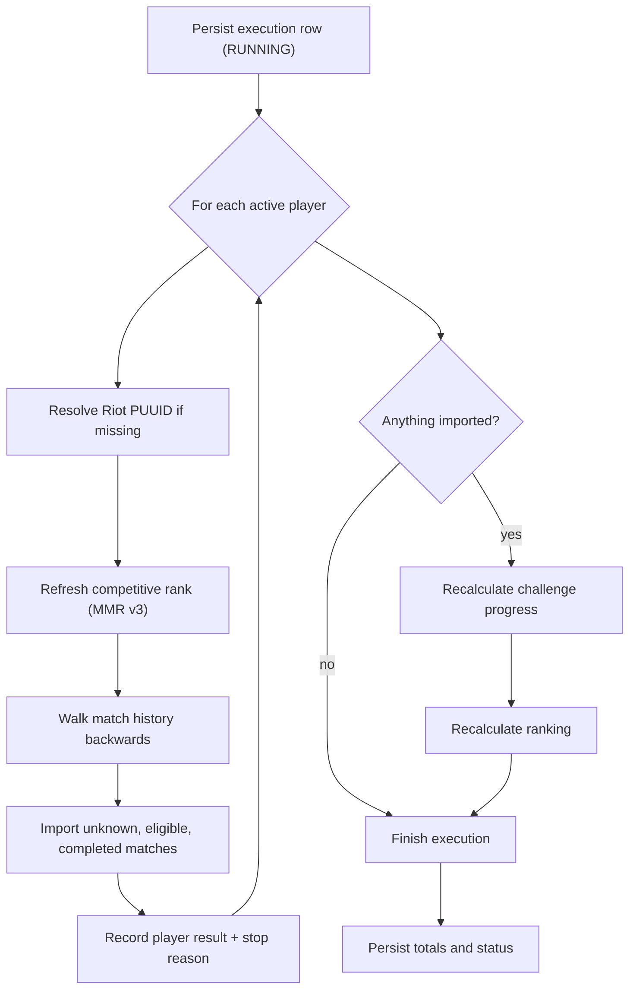

# Synchronization

How Valorant match data enters the application. Henrik is treated as an unreliable external system throughout: rate
limited, retried where retrying helps, and never trusted to be complete or well-formed.

The decisions this document implements are recorded in
[ADR 0005](../../docs/adr/0005-non-transactional-synchronization.md) (no surrounding transaction) and
[ADR 0008](../../docs/adr/0008-season-scoped-history.md) (season-scoped history).

## Triggers

| Trigger                                          | Recorded as | Notes                                             |
| ------------------------------------------------ | ----------- | ------------------------------------------------- |
| `StandardSynchronizationScheduler`               | `SCHEDULED` | Default `0 0 6,12,18 * * *` in `SCHEDULING_ZONE`  |
| `WeeklyRolloverScheduler`                        | `SCHEDULED` | Runs one synchronization before finalizing a week |
| `POST /api/admin/synchronizations`               | `MANUAL`    | All active players                                |
| `POST /api/admin/players/{playerId}/synchronizations` | `MANUAL` | One player                                       |

All of them enter the same `SynchronizationCommandService`, so a scheduled run and a manual one behave identically and
benefit from the same failure isolation.

## Pipeline



The execution row is written **before** processing starts, and each player's outcome is recorded independently. Nothing
in this pipeline runs inside a transaction.

Recalculation is part of the workflow, not an afterthought: importing matches is only half the job, since challenge
progress and the weekly ranking are derived from stored matches and stay stale until rebuilt. An execution that
imported something therefore always ends with a challenge recalculation, which is what keeps the ranking live between
two scheduled runs.

## Per player

`PlayerSynchronizationService` handles one player:

1. **Resolve the account.** A player seeded without a PUUID is resolved from its game name and tag line through
   Henrik's account endpoint, and the result is persisted.
2. **Refresh the rank.** The MMR endpoint supplies the current competitive tier and rank rating.
3. **Walk the match history.** Delegated to `SeasonMatchHistoryWalker`, which owns the season scope and the pagination
   rules.
4. **Record the outcome.** Pages fetched, matches imported, completion timestamp and the reason the walk stopped.

A failure at any step marks that player as failed and does not stop the batch.

## Match-history walk

Henrik returns matches newest-first, ten per page. The walk starts at offset zero and moves backwards through time.

**Scope.** The season of the newest match. Everything that season holds is imported; the walk stops when it crosses
into an older one.

**Two rules make the result trustworthy:**

- A season is marked complete only once the walk proved it reached that season's oldest match - by crossing into an
  older season, or by exhausting the available history. Until then the stored history may have holes, so the next run
  re-walks the season in full instead of stopping at the first already-stored match.
- An older season is walked only when the player already has an unfinished state for it. That finishes what a previous
  run started, whether it was interrupted or overtaken by an act change, without ever widening the scope: on an empty
  database no older state exists, so a first run is bounded by the current season.

**Stop conditions are evaluated on the raw Henrik page, never on the subset actually imported.** A page holding nothing
but ignored game modes proves nothing about the history behind it and must not read as a boundary.

| `stop_reason`           | Meaning                                                            | Healthy? |
| ----------------------- | ------------------------------------------------------------------ | -------- |
| `SEASON_BOUNDARY`       | The walk crossed into an older act. The season is complete.         | yes      |
| `KNOWN_HISTORY_REACHED` | Every match on the page was already stored. Steady-state increment. | yes      |
| `END_OF_HISTORY`        | Henrik returned a short page. No history remains.                   | yes      |
| `EMPTY_PAGE`            | Henrik returned nothing.                                            | yes      |
| `PAGE_LIMIT_REACHED`    | The 300-page safety limit stopped the walk. The season is **not** marked complete. | no |

`PAGE_LIMIT_REACHED` deliberately leaves the season incomplete: freezing a truncated walk would turn the truncation
into a permanent hole. A page size of 10 and a limit of 300 pages bound any single walk to 3000 matches.

**Known limitation.** Seasons interleaved across a page boundary are not detected: if the last match of a page belongs
to an older season and the first match of the next page belongs to the current one again, the walk stops early. This
would require Riot to have tagged an older match with a newer act, while Henrik orders matches strictly by descending
start instant.

## Import filter

`MatchImportService` rejects, skips or imports each match on the page. The distinction matters for diagnosis, which is
why a rejection names the failed precondition rather than returning a bare boolean: a whole game mode disappearing
because Henrik systematically omits one field is otherwise indistinguishable from the player not having played it.

| Outcome         | Cause                                                                                       |
| --------------- | ------------------------------------------------------------------------------------------- |
| `REJECTED`      | No metadata, match not completed, missing match id, missing start instant, missing season id, or the tracked player is absent from the participant list |
| `SKIPPED`       | The normalized game mode is not import-eligible                                              |
| `ALREADY_KNOWN` | A `player_match` row already exists for this player and match                                |
| `IMPORTED`      | Persisted                                                                                    |

Idempotency is enforced by the schema, not only by these checks: `valorant_match.external_match_id` is unique and
`uk_player_match_player_match` forbids a second row for the same player and match. Re-running an interrupted import is
therefore safe by construction.

Seasons are resolved - and created on first sight - by `SeasonResolutionService` from the identifier Henrik reports on
the match, which is why season dates are nullable.

## Henrik client

```text
DefaultHenrik*Client  →  HenrikRequestExecutor  →  HenrikRequestLimiter  →  WebClient
                                  ↓                        ↓
                          HenrikRetryStrategy      HenrikResponseHandler
```

| Endpoint       | Path                                                        |
| -------------- | ----------------------------------------------------------- |
| Account        | `/valorant/v2/account/{gameName}/{tagLine}`                  |
| MMR            | `/valorant/v3/by-puuid/mmr/{region}/{platform}/{puuid}`      |
| Match history  | `/valorant/v4/by-puuid/matches/{region}/{platform}/{puuid}`  |

### Rate limiting

Henrik's limit applies to the **API key**, not to a player or an endpoint, so every account, MMR and match-history call
shares one `HenrikRequestLimiter`. Requests are spaced evenly over the minute rather than allowed to burst: a burst
followed by a long pause is worse for a scheduled batch than a steady cadence, and it exhausts the quota at the start
of an execution.

`HENRIK_API_REQUESTS_PER_MINUTE` defaults to 28, deliberately under the provider limit, plus a
`HENRIK_API_RATE_LIMIT_SAFETY_MARGIN` between consecutive calls.

### Failure mapping and retries

`HenrikResponseHandler` converts an unsuccessful response into a typed exception, and each exception declares whether
retrying it can help:

| Upstream status | Exception                          | Retryable |
| --------------- | ---------------------------------- | --------- |
| 404             | `HenrikResourceNotFoundException`  | no        |
| 408             | `HenrikRequestTimeoutException`    | yes       |
| 429             | `HenrikRateLimitException`         | yes       |
| 500/502/503/504 | `HenrikServiceUnavailableException`| yes       |
| Other 4xx       | `HenrikClientRequestException`     | no        |

Only temporary failures are retried; an unknown player or a malformed request fails immediately rather than burning
quota. `HENRIK_API_MAX_ATTEMPTS` **includes** the first request, so the default of 2 means one retry. A rate-limit
response uses Henrik's `Retry-After` header when it specifies a longer delay than the configured
`HENRIK_API_RETRY_DELAY`.

## Failure isolation

- A player whose synchronization throws is recorded as failed with its error message; the batch continues.
- An execution with at least one failure and at least one success ends as `PARTIAL`.
- Failure descriptions are aggregated onto the execution row so a single query answers what went wrong.
- Because nothing is transactional, matches imported before a failure stay imported. Correctness comes from
  idempotency, not from rollback.

## Monitoring

```http
GET /api/admin/synchronizations/latest
GET /api/admin/synchronizations?page=0&size=20
GET /api/admin/synchronizations/{synchronizationId}
```

The detail route returns one row per player, including its status, pages fetched, matches imported, error message and
stop reason.

## Benchmark

An end-to-end benchmark of the six-player standard synchronization is available once the application and PostgreSQL are
running, from the repository root:

```bash
ADMIN_KEY="$ADMIN_API_KEY" RUNS=3 ./scripts/benchmark-full-synchronization.sh
```

Results are written to `target/full-synchronization-benchmark.csv`. Any non-200 response stops the benchmark and prints
the upstream error body.

## Not covered by automated tests

Live Henrik calls are intentionally excluded from the test suite: they depend on credentials, on a shared rate limit
and on upstream data that changes. The client is covered against MockWebServer instead, and the end-to-end behavior is
validated manually through the release checklist in the [backend README](../README.md).
