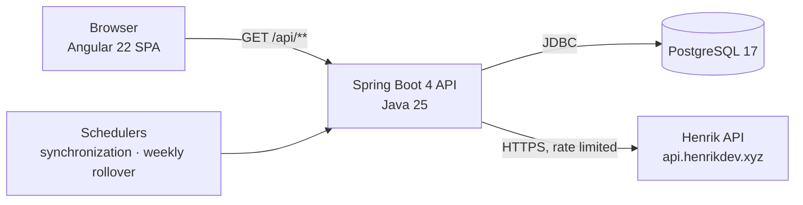
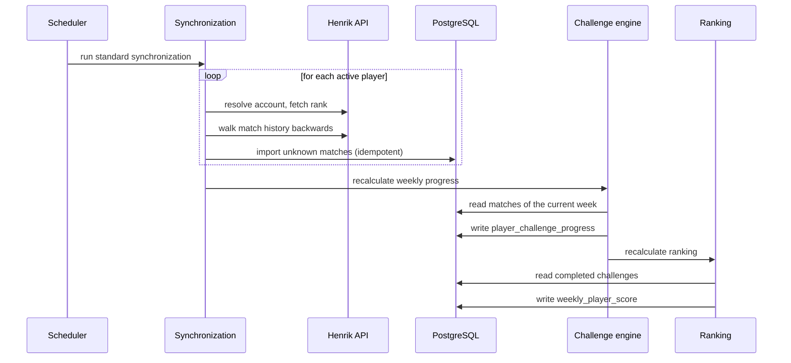

# Architecture

System-level view of Valorant Tracker: what the parts are, how a request travels through them, and which boundaries
must not be crossed. Module-internal structure is documented in
[`backend/docs/architecture.md`](../backend/docs/architecture.md) and
[`frontend/docs/architecture.md`](../frontend/docs/architecture.md).

## Components



| Component  | Responsibility                                                                                   |
| ---------- | ------------------------------------------------------------------------------------------------ |
| Frontend   | Renders the weekly competition. Holds no business rule; every number it displays is computed by the API. |
| Backend    | Imports matches, derives statistics, selects challenges, calculates progress and maintains the ranking. |
| PostgreSQL | Single source of truth. Every derived value is recomputable from the stored matches.               |
| Henrik API | Sole external data source. Treated as unreliable: rate limited, retried, and never trusted to be complete. |

The application tracks roughly six predefined players. That number is a design input, not an accident: it is what makes
full recalculation from stored matches cheap enough to be the normal path rather than an emergency procedure.

## Runtime topology

The backend serves the API and the built frontend from the same origin in production, so `apiBaseUrl` is the relative
path `/api`. In development the Angular dev server proxies `/api` to `localhost:8080` through `proxy.conf.json`, which
keeps both sides same-origin there too. `FRONTEND_ORIGIN` configures the CORS allowance for the case where the two are
deployed separately.

## Request flow

A read request crosses four layers and never more:

```text
Controller  →  Service  →  Repository  →  PostgreSQL
    ↑             ↑
   DTO        business rule
```

- Controllers expose HTTP and nothing else. They bind parameters, delegate, and return a DTO.
- Services own every business decision, including which values are valid and what an empty result means.
- Repositories own persistence. They never decide.
- DTOs define the API contract and are immutable records, distinct from the entities they are derived from.

The frontend mirrors this discipline in the opposite direction: it consumes DTOs and formats them for display, and it
never recomputes a statistic, a ranking position or a challenge percentage the backend already sent.

## Background jobs

Two scheduled jobs drive the application forward; both are also reachable as administrative commands so an operator can
run them on demand.

| Job                      | Default schedule           | Zone                | Effect                                                                     |
| ------------------------ | -------------------------- | ------------------- | -------------------------------------------------------------------------- |
| Standard synchronization | `0 0 6,12,18 * * *`        | `Europe/Paris`      | Imports each active player's new matches, then recalculates challenges and the ranking. |
| Weekly rollover          | `0 5 0 * * MON`            | `UTC`               | Synchronizes once, finalizes the previous week, then prepares the new one.  |

The rollover synchronizes before it finalizes on purpose: the last scheduled synchronization of a week ends hours before
Monday 00:05, and matches played in that gap would otherwise be imported into a week that is already frozen, counting
for nothing.

Scheduling uses `SCHEDULING_ZONE` for the synchronization job, while every weekly calculation uses
`WEEK_ROLLOVER_ZONE`. These are deliberately separate: the first is an operational preference, the second is a business
rule that decides which week a Sunday-night match belongs to. See
[ADR 0006](adr/0006-single-week-calendar.md).

## Data flow



Everything downstream of the import is derived. Challenge progress is recomputed from persisted matches rather than
incremented as matches arrive, and the ranking is recomputed from completed challenges rather than from statistics.
That is what makes a rerun produce the same result as the first run, and what lets a bad import be corrected by
re-running the calculation instead of by patching stored totals.

## Invariants across the boundary

These hold for the system as a whole and are enforced in the backend. Breaking any of them is a defect, not a trade-off.

1. **Imports are idempotent.** Re-importing the same Henrik payload creates no duplicate match and no duplicate
   player-match association; a unique constraint enforces it rather than application code alone.
2. **One player's failure isolates.** A player whose synchronization fails is recorded as failed, and the remaining
   players are still processed.
3. **Derived data is recomputable.** Challenge progress and weekly scores can be rebuilt from stored matches at any
   time, and rebuilding produces the same values.
4. **Finalized history is immutable.** Once a week is finalized, its challenge results and its ranking never change,
   including when a later synchronization imports a match played during that week.
5. **Statistics never decide a ranking.** Points come from completed challenges. Statistics exist to feed challenge
   progress and to be displayed.
6. **Timestamps are stored in UTC.** Only their calendar interpretation uses a configured zone.

## Security boundary

- Every `GET /api/**` route is public; the data is a group's game statistics and carries no personal secret.
- Every `/api/admin/**` route requires the `X-Admin-Key` header, checked by a servlet filter before the security chain's
  authorization rules. A missing key answers `ADMIN_KEY_MISSING`, a wrong one `ADMIN_KEY_INVALID`.
- Anything not explicitly matched is denied.
- Secrets arrive through environment variables and are never committed. Logs carry identifiers and counts, never keys or
  complete upstream payloads.

See [ADR 0007](adr/0007-admin-api-key.md) for why a shared key rather than user accounts.

## Repository layout

```text
valorant-tracker
├── backend     Java 25 / Spring Boot 4 API (Maven)
├── frontend    Angular 22 application
├── scripts     Operational scripts
├── docs        Project-wide documentation (this directory)
└── .github     Continuous integration workflows
```

Each module owns its build, its tooling and its own documentation directory. Nothing is shared between them at build
time: the contract between the two is the REST API, and it is the only coupling that exists.
