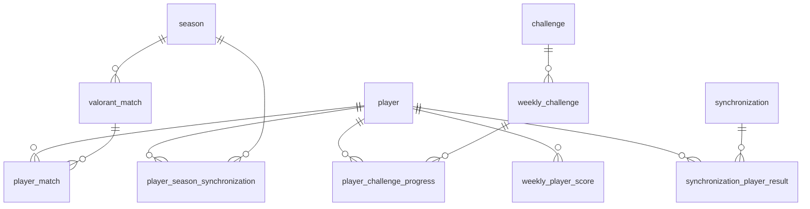

# Data model

PostgreSQL is the single source of truth. Flyway owns the schema; Hibernate runs with
`ddl-auto=validate` and only checks that the mapped entities agree with the migrated schema. Every table carries
`created_at` and `updated_at` (`TIMESTAMPTZ NOT NULL DEFAULT now()`) through the shared auditable base entity; they are
omitted from the column lists below.

The business meaning of these tables is in [`domain-model.md`](domain-model.md).

## Overview

## Tables

### `player`

Tracked Riot accounts. Seeded by migration; never created through the API.

| Column                               | Type           | Notes                                                     |
| ------------------------------------ | -------------- | --------------------------------------------------------- |
| `id`                                 | `BIGSERIAL`    | Primary key                                                |
| `riot_puuid`                         | `VARCHAR(100)` | Unique, **nullable**: resolved on first synchronization    |
| `game_name`                          | `VARCHAR(32)`  | Riot game name                                             |
| `tag_line`                           | `VARCHAR(16)`  | Riot tag line                                              |
| `display_name`                       | `VARCHAR(64)`  | Name shown in the UI                                       |
| `portrait`                           | `VARCHAR(255)` | Agent portrait key resolved to an asset by the frontend    |
| `competitive_tier`                   | `VARCHAR(32)`  | Default `UNRANKED`                                         |
| `rank_rating`                        | `INTEGER`      | Rank rating within the tier                                |
| `status`                             | `VARCHAR(16)`  | `ACTIVE` / `INACTIVE`, default `ACTIVE`                    |
| `last_successful_synchronization_at` | `TIMESTAMPTZ`  | Incremental-import watermark                               |

### `season`

Valorant acts, discovered during import.

| Column        | Type           | Notes                                                       |
| ------------- | -------------- | ----------------------------------------------------------- |
| `id`          | `BIGSERIAL`    | Primary key                                                  |
| `external_id` | `VARCHAR(64)`  | Unique. Riot's season identifier as reported by Henrik        |
| `name`        | `VARCHAR(100)` | Act label                                                    |
| `starts_at`   | `TIMESTAMPTZ`  | **Nullable**: match history exposes the label, not the dates  |
| `ends_at`     | `TIMESTAMPTZ`  | **Nullable**, same reason                                    |
| `active`      | `BOOLEAN`      | Default `false`                                              |

### `valorant_match`

What is true of a match regardless of who played it.

| Column              | Type           | Notes                                                   |
| ------------------- | -------------- | ------------------------------------------------------- |
| `id`                | `BIGSERIAL`    | Primary key                                              |
| `external_match_id` | `VARCHAR(100)` | **Unique** - the duplicate-import guard                  |
| `season_id`         | `BIGINT`       | FK → `season(id)`                                        |
| `started_at`        | `TIMESTAMPTZ`  | Match start, UTC                                         |
| `duration_seconds`  | `INTEGER`      |                                                          |
| `map_id`            | `VARCHAR(64)`  |                                                          |
| `map_name`          | `VARCHAR(100)` |                                                          |
| `game_mode`         | `VARCHAR(32)`  | Normalized `GameMode`                                    |
| `queue_id`          | `VARCHAR(64)`  | Raw Henrik queue slug, kept for reclassification         |
| `red_score`         | `INTEGER`      |                                                          |
| `blue_score`        | `INTEGER`      |                                                          |

Keeping `queue_id` alongside the normalized mode is what made migrations `V11` and `V12` possible: matches imported
before a queue was recognized could be reclassified deterministically from stored data instead of being re-fetched.

### `player_match`

One tracked player's performance in one match.

| Column             | Type            | Notes                                              |
| ------------------ | --------------- | -------------------------------------------------- |
| `id`               | `BIGSERIAL`     | Primary key                                         |
| `player_id`        | `BIGINT`        | FK → `player(id)`                                   |
| `match_id`         | `BIGINT`        | FK → `valorant_match(id)`                           |
| `agent_id`         | `VARCHAR(64)`   |                                                     |
| `agent_name`       | `VARCHAR(64)`   |                                                     |
| `team_id`          | `VARCHAR(100)`  | Team identifier as returned by Henrik               |
| `result`           | `VARCHAR(16)`   | `WIN` / `LOSS` / `DRAW` / `REMAKE` / `UNKNOWN`      |
| `kills`            | `INTEGER`       |                                                     |
| `deaths`           | `INTEGER`       |                                                     |
| `assists`          | `INTEGER`       |                                                     |
| `score`            | `INTEGER`       |                                                     |
| `headshots`        | `INTEGER`       |                                                     |
| `bodyshots`        | `INTEGER`       |                                                     |
| `legshots`         | `INTEGER`       |                                                     |
| `damage_dealt`     | `INTEGER`       |                                                     |
| `rounds_played`    | `INTEGER`       |                                                     |
| `acs`              | `NUMERIC(8,2)`  | **Nullable**: meaningless for non round-based modes  |
| `adr`              | `NUMERIC(8,2)`  | **Nullable**, same reason                           |
| `competitive_tier` | `VARCHAR(32)`   | Tier held at the time of the match                  |
| `rank_rating`      | `INTEGER`       |                                                     |
| `was_mvp`          | `BOOLEAN`       | Default `false`                                     |

Constraint `uk_player_match_player_match UNIQUE (player_id, match_id)`. This is the idempotency guarantee: re-importing
the same Henrik payload cannot create a second row for the same player and match.

`acs` and `adr` are null rather than zero where they do not apply, so an absent value is never averaged into a player's
statistics as a real zero.

### `challenge`

The challenge catalogue. Reference data owned by migrations.

| Column            | Type           | Notes                                                 |
| ----------------- | -------------- | ----------------------------------------------------- |
| `id`              | `BIGSERIAL`    | Primary key                                            |
| `code`            | `VARCHAR(80)`  | Unique business key                                    |
| `name`            | `VARCHAR(120)` | Displayed name                                         |
| `description`     | `VARCHAR(500)` | Displayed description                                  |
| `difficulty`      | `VARCHAR(20)`  | `EASY` / `NORMAL` / `MEDIUM` / `HARD` / `VERY_HARD`    |
| `points`          | `INTEGER`      | Reward on completion                                   |
| `category`        | `VARCHAR(30)`  | Selection diversity dimension                          |
| `rule_type`       | `VARCHAR(20)`  | Shape of the rule                                      |
| `progress_mode`   | `VARCHAR(30)`  | Selects the calculator                                 |
| `conditions_json` | `JSONB`        | Typed condition array, parsed by the challenge engine   |
| `exclusion_group` | `VARCHAR(80)`  | **Nullable**. Two challenges of one group never share a week |
| `enabled`         | `BOOLEAN`      | Default `true`. Disabled rows are never selected        |
| `schema_version`  | `INTEGER`      | Version of the condition payload format                 |

`conditions_json` is `JSONB` rather than `TEXT` so the payload stays queryable: migration `V14` deleted every challenge
filtered on a retired game mode by matching on the condition array itself, rather than on a hand-maintained list of
challenge codes.

### `weekly_challenge`

A challenge assigned to one week.

| Column         | Type          | Notes                                        |
| -------------- | ------------- | -------------------------------------------- |
| `id`           | `BIGSERIAL`   | Primary key                                   |
| `week_start`   | `DATE`        | Monday identifying the week                   |
| `challenge_id` | `BIGINT`      | FK → `challenge(id)`                          |
| `selected_at`  | `TIMESTAMPTZ` | Shared across the whole pack                  |
| `finalized_at` | `TIMESTAMPTZ` | **Nullable**. Non-null means the week is frozen |

Constraint `uk_weekly_challenge_week_challenge UNIQUE (week_start, challenge_id)`.

### `player_challenge_progress`

| Column                | Type             | Notes                            |
| --------------------- | ---------------- | -------------------------------- |
| `id`                  | `BIGSERIAL`      | Primary key                       |
| `player_id`           | `BIGINT`         | FK → `player(id)`                 |
| `weekly_challenge_id` | `BIGINT`         | FK → `weekly_challenge(id)`       |
| `current_value`       | `NUMERIC(14,4)`  | Default `0`                       |
| `target_value`        | `NUMERIC(14,4)`  | Copied from the resolved rule      |
| `completed`           | `BOOLEAN`        | Default `false`                   |
| `completed_at`        | `TIMESTAMPTZ`    | **Nullable**                      |
| `calculated_at`       | `TIMESTAMPTZ`    | Last recalculation                 |

Constraint `uk_progress_player_weekly_challenge UNIQUE (player_id, weekly_challenge_id)`.

`NUMERIC` rather than a floating-point type: challenge progress decides points, and a ratio challenge compared with
binary floating point would produce results that differ between runs.

### `weekly_player_score`

| Column                 | Type          | Notes                                          |
| ---------------------- | ------------- | ---------------------------------------------- |
| `id`                   | `BIGSERIAL`   | Primary key                                     |
| `player_id`            | `BIGINT`      | FK → `player(id)`                               |
| `week_start`           | `DATE`        | Monday identifying the week                     |
| `points`               | `INTEGER`     | Sum of completed challenge rewards, default `0` |
| `completed_challenges` | `INTEGER`     | Default `0`                                     |
| `position`             | `INTEGER`     | 1-based                                         |
| `previous_position`    | `INTEGER`     | **Nullable**: position before this recalculation |
| `calculated_at`        | `TIMESTAMPTZ` |                                                 |
| `finalized_at`         | `TIMESTAMPTZ` | **Nullable**. Non-null means the week is frozen  |

Constraint `uk_weekly_score_player_week UNIQUE (player_id, week_start)`.

### `synchronization`

One execution of the import workflow.

| Column              | Type            | Notes                                              |
| ------------------- | --------------- | -------------------------------------------------- |
| `id`                | `BIGSERIAL`     | Primary key                                         |
| `type`              | `VARCHAR(40)`   | `STANDARD`                                          |
| `trigger_type`      | `VARCHAR(20)`   | `SCHEDULED` / `MANUAL`                              |
| `status`            | `VARCHAR(20)`   | `PENDING` / `RUNNING` / `PARTIAL` / `COMPLETED` / `FAILED` / `CANCELLED` |
| `started_at`        | `TIMESTAMPTZ`   | **Nullable** until the run starts                   |
| `finished_at`       | `TIMESTAMPTZ`   | **Nullable** until the run ends                     |
| `players_processed` | `INTEGER`       | Default `0`                                         |
| `failure_count`     | `INTEGER`       | Default `0`                                         |
| `matches_imported`  | `INTEGER`       | Default `0`                                         |
| `error_message`     | `VARCHAR(2000)` | **Nullable**, aggregated failure descriptions        |

### `synchronization_player_result`

One player's outcome inside one execution.

| Column               | Type            | Notes                                                    |
| -------------------- | --------------- | -------------------------------------------------------- |
| `id`                 | `BIGSERIAL`     | Primary key                                               |
| `synchronization_id` | `BIGINT`        | FK → `synchronization(id)`                                |
| `player_id`          | `BIGINT`        | FK → `player(id)`                                         |
| `status`             | `VARCHAR(20)`   |                                                           |
| `pages_fetched`      | `INTEGER`       | Default `0`                                               |
| `matches_imported`   | `INTEGER`       | Default `0`                                               |
| `error_message`      | `VARCHAR(2000)` | **Nullable**                                              |
| `stop_reason`        | `VARCHAR(30)`   | **Nullable**: a failed player never completed a walk       |

Constraint `uk_sync_player_result UNIQUE (synchronization_id, player_id)`.

`stop_reason` is what makes an incomplete import self-explanatory: `SEASON_BOUNDARY` answers "why does this player have
fewer matches than their public tracker profile shows" without any database or Henrik inspection, and
`PAGE_LIMIT_REACHED` distinguishes a truncated run from a healthy one. The full set is `EMPTY_PAGE`, `END_OF_HISTORY`,
`SEASON_BOUNDARY`, `KNOWN_HISTORY_REACHED`, `PAGE_LIMIT_REACHED`.

### `player_season_synchronization`

How far the match-history walk got, per player and season.

| Column         | Type          | Notes                                              |
| -------------- | ------------- | -------------------------------------------------- |
| `id`           | `BIGSERIAL`   | Primary key                                         |
| `player_id`    | `BIGINT`      | FK → `player(id)`                                   |
| `season_id`    | `BIGINT`      | FK → `season(id)`                                   |
| `complete`     | `BOOLEAN`     | Default `false`. True only once the oldest match was reached |
| `completed_at` | `TIMESTAMPTZ` | **Nullable**                                        |

Constraint `uk_player_season_synchronization UNIQUE (player_id, season_id)`. No additional index: that constraint's
btree already serves both lookups the repository performs, its leading column being `player_id`.

The row's mere presence is itself a signal. It is written when a season's walk **starts**, so a season with no row was
never targeted and must be left alone - which is what bounds a first run on an empty database to the current season
while still letting a run finish a season it had started before Riot rolled the act over.

## Indexes

Each index below was added to support one identified query, not speculatively.

| Index                                                     | Table                        | Supports                                                    |
| --------------------------------------------------------- | ---------------------------- | ----------------------------------------------------------- |
| `idx_match_started_at`                                    | `valorant_match`             | Chronological match listing                                  |
| `idx_valorant_match_queue_id`                             | `valorant_match`             | Queue-based filtering and reclassification                   |
| `idx_valorant_match_season_started_at`                    | `valorant_match`             | Match-history filtering and sorting through the join         |
| `idx_player_match_player`                                 | `player_match`               | Matches of one player                                        |
| `idx_player_match_player_match`                           | `player_match`               | Chronological challenge calculation after filtering by player |
| `idx_player_status_id`                                    | `player`                     | Active-player lookup used by every synchronization           |
| `idx_weekly_challenge_week`                               | `weekly_challenge`           | Pack lookup by week                                          |
| `idx_weekly_challenge_week_finalized_id`                  | `weekly_challenge`           | Active and finalized weekly-challenge reads                  |
| `idx_progress_weekly_challenge`                           | `player_challenge_progress`  | Progress of one weekly challenge                             |
| `idx_player_challenge_progress_weekly_challenge_player`   | `player_challenge_progress`  | Joins starting from a weekly challenge                       |
| `idx_player_challenge_progress_player_weekly`             | `player_challenge_progress`  | Week-wide progress aggregation without table scans           |
| `idx_weekly_score_week_position`                          | `weekly_player_score`        | Current ranking by position                                  |
| `idx_weekly_player_score_finalized_week_position`         | `weekly_player_score`        | Ranking-history pagination over finalized weeks              |
| `idx_sync_created_at`                                     | `synchronization`            | Recent executions                                            |
| `idx_synchronization_started_at_id`                       | `synchronization`            | Latest execution by business start time                      |
| `idx_synchronization_player_result_synchronization_player` | `synchronization_player_result` | Per-player results of one execution                       |

## Migration history

Applied migrations are immutable. Every schema or reference-data change requires a new versioned file in
`backend/src/main/resources/db/migration`.

| Version | Name                                       | Effect                                                                          |
| ------- | ------------------------------------------ | ------------------------------------------------------------------------------- |
| `V1`    | `create_schema`                            | Initial schema and base indexes                                                  |
| `V2`    | `insert_players`                           | Commented placeholder for the tracked accounts                                   |
| `V3`    | `insert_challenges`                        | Seeds 78 challenge definitions                                                   |
| `V4`    | `prepare_henrik_synchronization`           | `riot_puuid` nullable, adds `queue_id` and `team_id`                             |
| `V5`    | `insert_players`                           | Seeds the six tracked accounts, PUUID left null                                  |
| `V6`    | `allow_unresolved_season_dates`            | Season dates nullable                                                            |
| `V7`    | `increase_player_match_team_id_length`     | `team_id` widened to 100                                                         |
| `V8`    | `remove_unused_deep_synchronization_task`  | Drops `deep_synchronization_task`                                                |
| `V9`    | `add_query_supporting_indexes`             | Indexes for player lookup, progress joins and sync reads                         |
| `V10`   | `optimize_read_queries`                    | Indexes for challenge calculation, match history and ranking history             |
| `V11`   | `recategorize_new_game_modes`              | Reclassifies `OTHER` matches into `SKIRMISH`, `NEW_MAP` and one `CUSTOM`         |
| `V12`   | `backfill_round_averages_for_recategorized_modes` | Rebuilds `acs`/`adr` for the matches `V11` reclassified                   |
| `V13`   | `reset_derived_synchronization_data`       | Truncates every table derived from Henrik data and clears the sync watermarks    |
| `V14`   | `remove_excluded_game_mode_challenges`     | Deletes the 16 challenges filtered on a mode no longer imported (78 → 62)        |
| `V15`   | `create_player_season_synchronization`     | Adds the per-season completion flag                                              |
| `V16`   | `add_synchronization_stop_reason`          | Adds `stop_reason` to per-player synchronization results                         |

`V13` is worth reading before assuming the database holds history: it deliberately wiped every match, season,
synchronization, weekly selection, progress row and score so synchronization could restart from a coherent base under
the season scope and game-mode filter introduced around it. The player rows and the challenge catalogue were kept.

## Test schema

Unit tests run against H2 in PostgreSQL compatibility mode with `ddl-auto=create-drop` and Flyway disabled: the schema
is generated from the entities. Integration tests (`@Tag("integration")`) instead start a `postgres:17-alpine`
Testcontainer, enable Flyway and set `ddl-auto=validate`, so the migrated schema and the mapped entities are checked
against each other on every run. `FlywayMigrationIntegrationTest` covers the migration chain itself.
