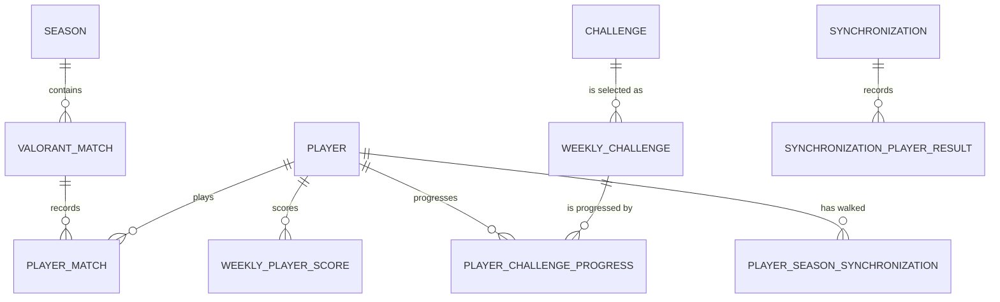
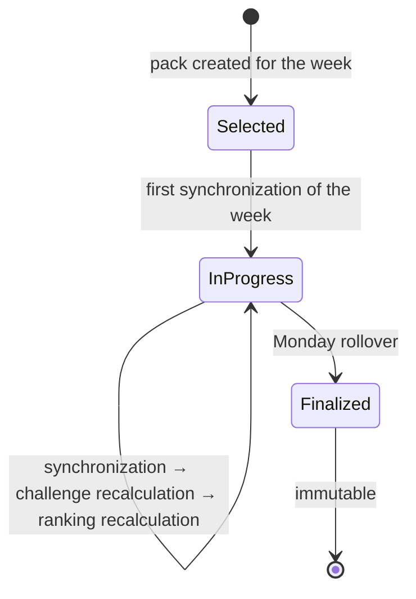

# Domain model

The business concepts Valorant Tracker manipulates, the lifecycle that ties them together, and the invariants the code
protects. Table definitions are in [`data-model.md`](data-model.md); the calculation mechanics are in
[`backend/docs/challenge-engine.md`](../backend/docs/challenge-engine.md).

## The question the application answers

> Who actually had the best week?

Everything else follows from that. Weekly challenges are the unit of competition, points come from completing them, and
statistics exist to feed challenge progress and to be displayed. Statistics are never the source of truth for a
ranking.

## Concepts

### Player

A tracked Riot account. Players are predefined and seeded by migration, not created through the API: the group is
fixed, and nobody joins or leaves mid-week.

A player is inserted with its Riot game name and tag line only. The Riot PUUID is resolved on the first successful
synchronization, which is why the column is nullable. A player carries a `status` (`ACTIVE` / `INACTIVE`) that decides
whether synchronization and ranking include it, a current `competitive_tier` and `rank_rating` refreshed from Henrik,
and the timestamp of its last successful synchronization.

### Season

A Valorant act, identified by the external identifier Henrik reports on each match. Seasons are discovered during
import rather than seeded, which is why their start and end dates are nullable: match history exposes the identifier
and the label, not the dates.

A season matters because it bounds what synchronization imports. See
[ADR 0008](adr/0008-season-scoped-history.md).

### Match and player match

`valorant_match` holds what is true of a match regardless of who played it: external identifier, season, start instant,
duration, map, normalized game mode, raw Henrik queue slug and team scores. `player_match` holds one tracked player's
performance in it: agent, result, kills, deaths, assists, score, shot breakdown, damage, rounds played, ACS, ADR, the
competitive tier held at the time, and whether the player was MVP.

The split is what makes an import of a match two friends both played store the match once and their performances
twice.

**Game modes.** `GameMode` normalizes Henrik's queue slugs and carries two flags per mode: whether it is round-based
(which decides whether per-round averages such as ACS and ADR are meaningful) and whether it is import-eligible.
Non-eligible modes are recognized but never stored, which is why challenges filtered on them were deleted rather than
disabled - see migration `V14`.

| Mode              | Round-based | Imported |
| ----------------- | ----------- | -------- |
| `COMPETITIVE`     | yes         | yes      |
| `UNRATED`         | yes         | yes      |
| `SPIKE_RUSH`      | yes         | yes      |
| `SKIRMISH`        | yes         | yes      |
| `PREMIER`         | yes         | yes      |
| `DEATHMATCH`      | no          | yes      |
| `TEAM_DEATHMATCH` | no          | yes      |
| `SWIFTPLAY`       | yes         | no       |
| `NEW_MAP`         | yes         | no       |
| `ESCALATION`      | no          | no       |
| `CUSTOM`          | yes         | no       |
| `OTHER`           | no          | yes      |

### Challenge

A catalogue entry: a name, a description, a difficulty, a point reward, a category, and a rule expressed as versioned
JSON conditions. Challenges are reference data owned by Flyway migrations, not by an admin API.

The catalogue currently holds **62 enabled definitions** across five difficulty tiers (`EASY`, `NORMAL`, `MEDIUM`,
`HARD`, `VERY_HARD`). Migration `V3` seeded 78; `V14` deleted the 16 filtered on a game mode synchronization no longer
imports.

Two fields govern selection rather than calculation:

- **`category`** - one of fourteen themes (`TRAINING`, `PERFORMANCE`, `AIM`, `AGENT`, `VICTORY`, …). Selection prefers a
  pack whose categories are all distinct.
- **`exclusion_group`** - a label shared by challenges that would be redundant together (for example every
  "competitive kills" variant). Two challenges of the same group can never appear in the same week.

### Weekly challenge

The association between a challenge and one week, identified by that week's Monday. A complete pack holds exactly one
challenge per difficulty tier - five challenges.

A pack is created once and never replaced during its week. A `finalized_at` timestamp marks the week as closed.

### Player challenge progress

One player's progress toward one weekly challenge: current value, target value, whether it is completed, when it was
completed, and when it was last calculated. Unique on `(player_id, weekly_challenge_id)`.

Progress is **recomputed** from persisted matches on every recalculation, never incremented as matches arrive. That is
what makes it deterministic: the same stored matches always produce the same progress.

### Weekly player score

One player's result for one week: points, completed challenge count, position, previous position, calculation
timestamp and finalization timestamp. Unique on `(player_id, week_start)`.

Ranking order is fully deterministic:

1. points, descending;
2. completed challenges, descending;
3. player identifier, ascending.

The third criterion exists so that two players who are genuinely tied still receive stable, reproducible positions
rather than an order that depends on how the database returned rows.

`previous_position` is the position the row held before the current recalculation, which is what lets the UI show a
player's movement without a separate history table.

### Synchronization

One execution of the import workflow, plus one result row per player processed. The execution records its trigger
(`SCHEDULED` / `MANUAL`), status, timings and totals; each player result records its own status, pages fetched,
matches imported, error message and the reason its match-history walk stopped.

`SynchronizationType` holds a single value, `STANDARD`: only an execution that calls Henrik is recorded here.
Challenge and ranking recalculations read exclusively from PostgreSQL and have never been persisted as
synchronizations.

### Player season synchronization

A per-player, per-season flag recording whether the match-history walk ever reached that season's oldest match. It is
the mechanism that keeps an interrupted import from leaving a permanent hole, and it is documented in detail in
[`backend/docs/synchronization.md`](../backend/docs/synchronization.md).

## The week

A week runs from **Monday 00:00 to the following Monday 00:00** in the configured week zone (`WEEK_ROLLOVER_ZONE`,
default `UTC`) and is identified throughout the application by that Monday's date.

`WeekCalendar` owns this definition. Challenge selection, challenge progress, active-day counting, ranking and rollover
all resolve week boundaries through it rather than computing them independently, because a single divergence would
silently move a Sunday-night match into the wrong week. See [ADR 0006](adr/0006-single-week-calendar.md).

Instants are stored in UTC. Only their calendar interpretation uses the configured zone.

## Weekly lifecycle

1. **Selection.** A pack of five challenges - one per difficulty - is created for the week. Selection is deterministic:
   candidates are ordered by a hash of the week and the challenge, so the same week yields the same pack across
   restarts. A pack that already exists is returned as-is; only missing difficulty tiers are filled.
2. **Progression.** Every synchronization that imported something recalculates challenge progress for the current week,
   then the ranking. Both read from stored matches.
3. **Finalization.** The Monday rollover synchronizes first, recalculates the closing week one last time, freezes it by
   stamping `finalized_at` on its challenges and scores, then prepares the new week's pack. The whole rollover runs in
   one transaction, so failing to create the new pack also rolls back the finalization of the old one.
4. **Immutability.** A finalized week is never recalculated again. A match played during that week but imported later
   counts for nothing - which is exactly why the rollover synchronizes before it finalizes.

Selection and rollover are both idempotent: a week already finalized is detected and left alone, and a partially
finalized pack is rejected as an inconsistent state rather than silently repaired.

## Invariants

| Invariant                                                | Enforced by                                                                 |
| -------------------------------------------------------- | --------------------------------------------------------------------------- |
| A match is stored once                                    | `valorant_match.external_match_id` unique                                    |
| A player has one row per match                            | `uk_player_match_player_match`                                               |
| A challenge appears at most once per week                 | `uk_weekly_challenge_week_challenge`                                         |
| A player has one progress row per weekly challenge        | `uk_progress_player_weekly_challenge`                                        |
| A player has one score per week                           | `uk_weekly_score_player_week`                                                |
| A week holds at most one challenge per difficulty         | `DefaultWeeklyChallengeSelectionService` validation                          |
| Two challenges of one exclusion group never share a week  | Selection compatibility check                                               |
| Progress equals what the stored matches imply             | Full recalculation, never incremental accumulation                           |
| A finalized week never changes                            | `finalized_at` guard in `DefaultWeeklyRolloverService`                       |
| Ranking positions are reproducible                        | Three-criterion comparator ending on the player identifier                   |
| One player's failure does not stop the batch              | Per-player result rows, no surrounding transaction                           |

## Not implemented

[`frontend/docs/boss.md`](../frontend/docs/boss.md) specifies a weekly-boss scoring model in which every rewarded action
deals damage to a shared boss and damage doubles as the individual ranking value. It is a design document for a future
iteration. No part of it is implemented, and the current ranking is points-from-completed-challenges as described
above.
